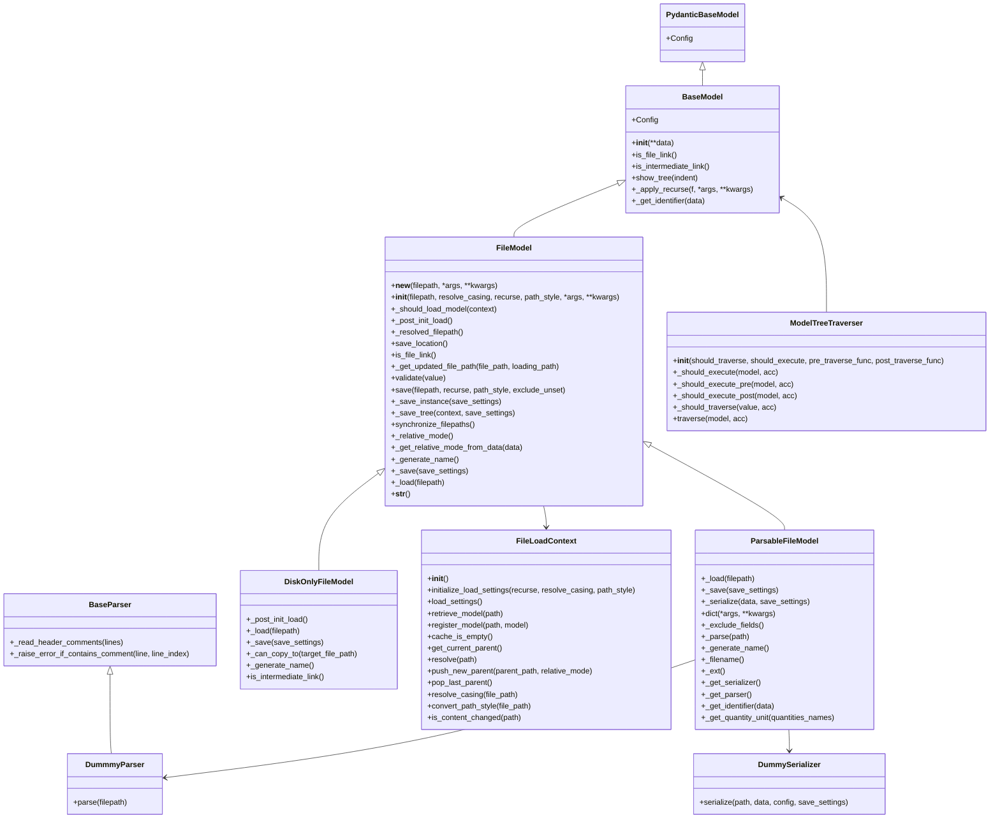
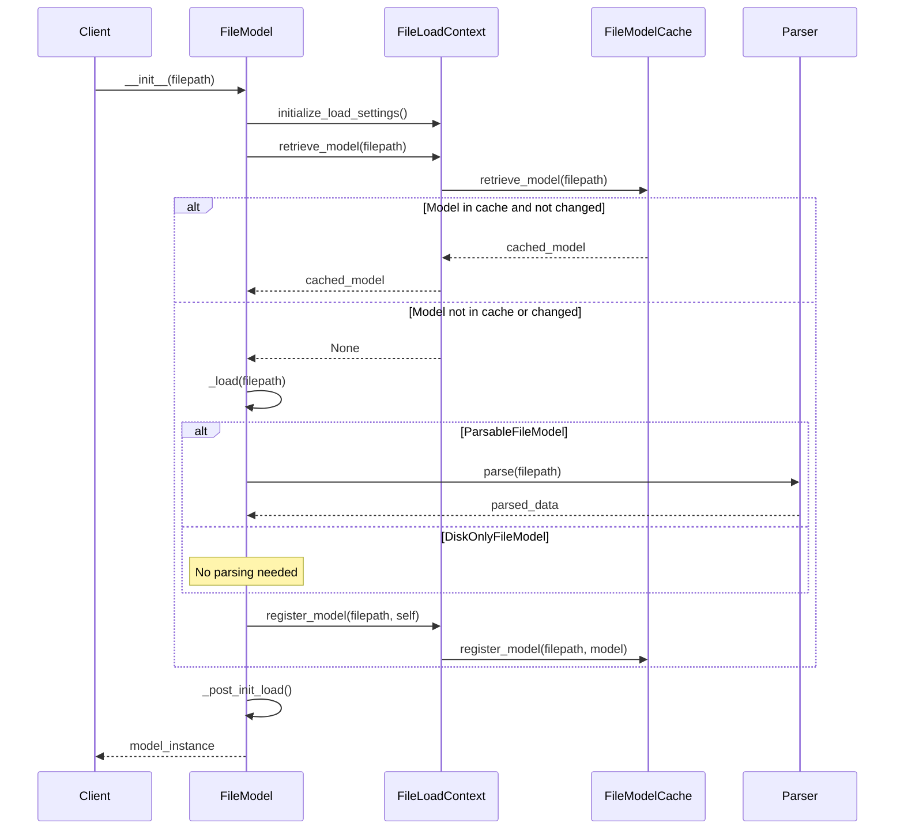
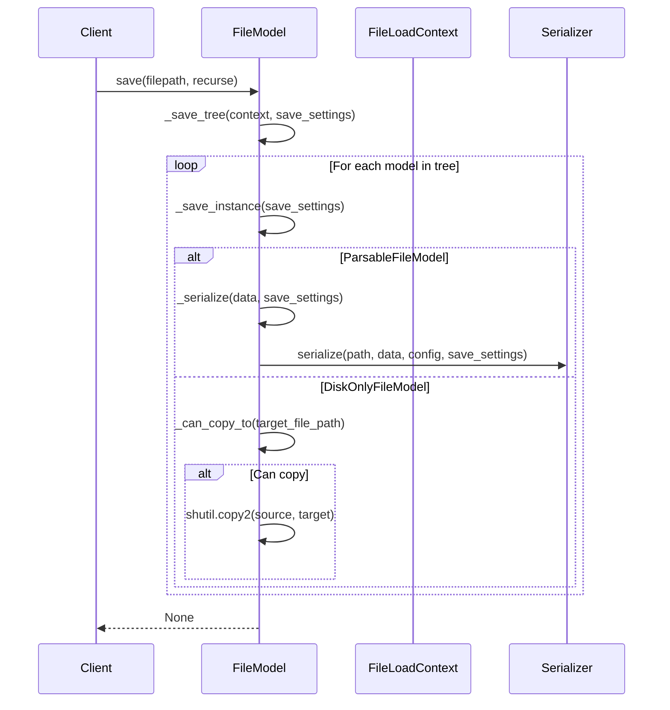
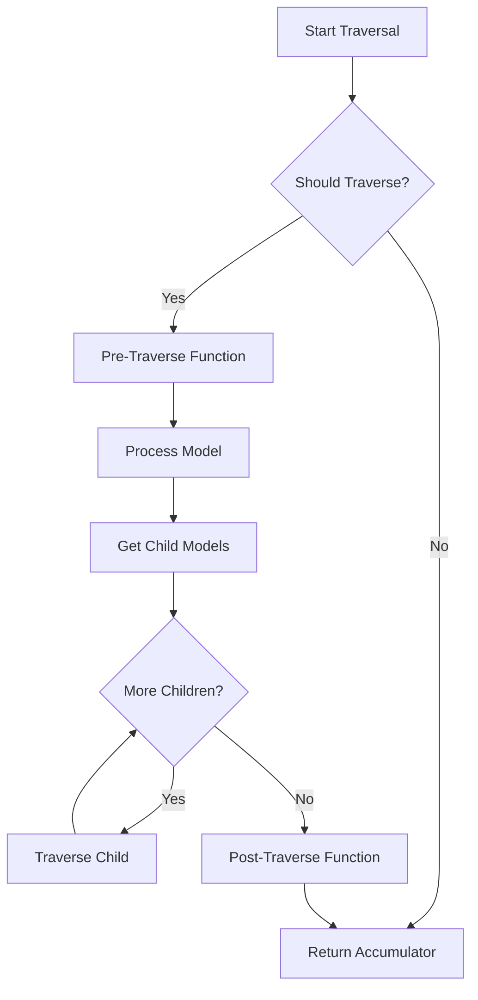

# Base Module

## Overview

The `hydrolib.core.base` module provides the foundational classes and utilities for the HYDROLIB-core library. This module handles file management, model representation, parsing, serialization, and various utility functions that are used throughout the library.

## Module Structure

The `hydrolib.core.base` module consists of the following files:

1. `file_manager.py` - Handles file management operations
2. `models.py` - Provides base model classes for data representation
3. `parser.py` - Contains base classes for parsing files
4. `serializer.py` - Contains base classes for serializing models to files
5. `utils.py` - Provides utility functions and classes

## Class Diagrams

### ASCII Class Diagram

```
+------------------+     +------------------+     +------------------+
| PydanticBaseModel|     | FileLoadContext  |     | BaseParser       |
+------------------+     +------------------+     +------------------+
        ^                        |                        ^
        |                        |                        |
+------------------+     +------------------+     +------------------+
| BaseModel        |<----| FileModel        |     | DummmyParser     |
+------------------+     +------------------+     +------------------+
                                ^
                                |
                +---------------+---------------+
                |                               |
    +------------------+               +------------------+
    | ParsableFileModel|               | DiskOnlyFileModel|
    +------------------+               +------------------+
```

### Mermaid Class Diagram



## Module Details

### file_manager.py

The `file_manager.py` module provides classes and functions for managing file operations, including path resolution, caching, and loading contexts.

#### Key Classes

1. **ResolveRelativeMode** - An enumeration for specifying how relative paths should be resolved:
   - `ANCHOR` - Resolve relative to the anchor path
   - `DIRECT_PARENT` - Resolve relative to the direct parent path

2. **FilePathResolver** - Handles resolving file paths:
   - `resolve(path)` - Resolves a path using the current context
   - `push_new_parent(parent_path, relative_mode)` - Adds a new parent path to the resolution stack
   - `pop_last_parent()` - Removes the last parent path from the resolution stack

3. **PathStyleValidator** - Validates path styles:
   - `validate(path_style)` - Validates that a path style is supported

4. **ModelLoadSettings** - Settings for model loading:
   - `recurse()` - Whether to recursively load referenced models
   - `resolve_casing()` - Whether to resolve file casing
   - `path_style()` - The path style to use

5. **CachedFileModel** - Represents a cached file model:
   - `model()` - The cached model
   - `checksum()` - The checksum of the file when it was cached

6. **FileModelCache** - Manages caching of file models:
   - `retrieve_model(path)` - Retrieves a model from the cache
   - `register_model(path, model)` - Registers a model in the cache
   - `has_changed(path)` - Checks if a file has changed since it was cached

7. **FileCasingResolver** - Resolves file casing issues:
   - `resolve(path)` - Resolves the correct casing for a file path

8. **FileLoadContext** - Provides context for file loading operations:
   - `initialize_load_settings(recurse, resolve_casing, path_style)` - Initializes load settings
   - `retrieve_model(path)` - Retrieves a model from the cache
   - `register_model(path, model)` - Registers a model in the cache
   - `resolve(path)` - Resolves a path using the current context
   - `resolve_casing(file_path)` - Resolves the correct casing for a file path
   - `convert_path_style(file_path)` - Converts a file path to the specified style

### models.py

The `models.py` module provides base model classes for data representation, including file-based models.

#### Key Classes

1. **BaseModel** - Base class for all models, extending Pydantic's BaseModel:
   - `is_file_link()` - Checks if the model is a file link
   - `is_intermediate_link()` - Checks if the model is an intermediate link
   - `show_tree(indent)` - Displays the model tree
   - `_apply_recurse(f, *args, **kwargs)` - Applies a function recursively to the model tree

2. **ModelTreeTraverser** - Traverses model trees with customizable behavior:
   - `traverse(model, acc)` - Traverses a model tree, applying functions pre and post traversal

3. **ModelSaveSettings** - Settings for model saving:
   - `path_style()` - The path style to use for saving

4. **FileModel** - Abstract base class for models that are loaded from/saved to files:
   - `save(filepath, recurse, path_style, exclude_unset)` - Saves the model to a file
   - `_save_tree(context, save_settings)` - Saves the model tree
   - `synchronize_filepaths()` - Synchronizes file paths in the model tree
   - `_load(filepath)` - Loads the model from a file

5. **SerializerConfig** - Configuration for serializers

6. **ParsableFileModel** - File model that can be parsed and serialized:
   - `_load(filepath)` - Loads the model from a file using a parser
   - `_save(save_settings)` - Saves the model to a file using a serializer
   - `_serialize(data, save_settings)` - Serializes the model data
   - `_parse(path)` - Parses a file into model data

7. **DiskOnlyFileModel** - File model that only exists on disk:
   - `_load(filepath)` - Loads the model from a file (no-op)
   - `_save(save_settings)` - Saves the model to a file (copies the file)

### parser.py

The `parser.py` module provides base classes for parsing files.

#### Key Classes

1. **BaseParser** - Base class for parsers with utility methods:
   - `_read_header_comments(lines)` - Reads header comments from a list of lines
   - `_raise_error_if_contains_comment(line, line_index)` - Raises an error if a line contains comments outside the header

2. **DummmyParser** - A simple dummy parser implementation:
   - `parse(filepath)` - Parses a file and returns an empty dictionary

### serializer.py

The `serializer.py` module provides base classes for serializing models to files.

#### Key Classes

1. **DummySerializer** - A simple dummy serializer implementation:
   - `serialize(path, data, config, save_settings)` - Serializes data to a file

### utils.py

The `utils.py` module provides utility functions and classes used throughout the library.

#### Key Functions

1. `to_key(string)` - Converts a string to a key format
2. `to_list(item)` - Converts an item to a list
3. `str_is_empty_or_none(str_field)` - Checks if a string is empty or None
4. `get_str_len(str_field)` - Gets the length of a string, handling None
5. `get_substring_between(source, start, end)` - Extracts a substring between two markers
6. `operator_str(operator_func)` - Converts an operator function to a string representation
7. `get_operating_system()` - Determines the current operating system
8. `get_path_style_for_current_operating_system()` - Gets the path style for the current OS

#### Key Classes

1. **OperatingSystem** - Enum for different operating systems:
   - `WINDOWS`
   - `LINUX`
   - `MACOS`

2. **PathStyle** - Enum for different path styles:
   - `WINDOWS`
   - `POSIX`

3. **FilePathStyleConverter** - Converts file paths between different styles:
   - `convert_to_os_style(file_path, source_path_style)` - Converts a file path to the OS style
   - `convert_from_os_style(file_path, target_path_style)` - Converts a file path from the OS style

4. **FileChecksumCalculator** - Calculates checksums for files:
   - `calculate_checksum(filepath)` - Calculates a checksum for a file

5. **FortranUtils** - Utilities for handling Fortran-specific formats:
   - `replace_fortran_scientific_notation(value)` - Replaces Fortran scientific notation

## Workflow Diagrams

### File Loading Process


#### Participants

- **Client**: The user or system that creates a `FileModel` instance.
- **FileModel**: The main model object to be loaded or parsed.
- **FileLoadContext**: Manages loading context and coordinates with the cache.
- **FileModelCache**: Stores and retrieves models to reduce redundant loading.
- **Parser**: Parses file content when needed.

#### Sequence Steps

##### 1. Initialization

```text
Client -> FileModel: __init__(filepath)
```

- The client creates an instance of `FileModel` with a given file path.

##### 2. Load Settings and Attempt Retrieval

```text
FileModel -> FileLoadContext: initialize_load_settings()
FileModel -> FileLoadContext: retrieve_model(filepath)
FileLoadContext -> FileModelCache: retrieve_model(filepath)
```

- The `FileModel` sets up the loading context.
- It then tries to retrieve the model from the `FileModelCache` via the `FileLoadContext`.

##### 3. Cache Handling

###### If the model **is cached** and **unchanged**:

```text
FileModelCache --> FileLoadContext: cached_model
FileLoadContext --> FileModel: cached_model
```

- Cached model is reused.

###### If the model **is not cached** or **has changed**:

```text
FileLoadContext --> FileModel: None
FileModel -> FileModel: _load(filepath)
```

- The model is reloaded from disk.

##### 4. File Parsing (Conditional)

###### If the model is a `ParsableFileModel`:

```text
FileModel -> Parser: parse(filepath)
Parser --> FileModel: parsed_data
```

- Parsing is performed by the `Parser`.

###### If the model is a `DiskOnlyFileModel`:

```text
Note over FileModel: No parsing needed
```

- No parsing is required.

##### 5. Registering the Model

```text
FileModel -> FileLoadContext: register_model(filepath, self)
FileLoadContext -> FileModelCache: register_model(filepath, model)
```

- The loaded model is registered into the cache.

##### 6. Post Initialization

```text
FileModel -> FileModel: _post_init_load()
FileModel --> Client: model_instance
```

- Final loading steps are performed.
- The model is returned to the client.

#### Summary

This diagram represents:

- **Lazy loading** of models.
- **Efficient reuse** through caching.
- **Conditional parsing** for performance.
- **Separation of concerns** across components.




### File Saving Process


#### Participants

- **Client**: The user or system that calls `save()` on a `FileModel` instance.
- **FileModel**: The object responsible for managing and saving model data.
- **FileLoadContext**: Provides contextual information needed during save operations.
- **Serializer**: Handles the actual serialization of data to disk.

#### Sequence Steps

##### 1. Saving Triggered

```text
Client -> FileModel: save(filepath, recurse)
```

- The client initiates the save process.

##### 2. Prepare to Save

```text
FileModel -> FileModel: _save_tree(context, save_settings)
```

- Internal method `_save_tree` is called with the context and settings.

##### 3. Saving Each Model

```text
loop For each model in tree
    FileModel -> FileModel: _save_instance(save_settings)
```

- Each model in the save tree is saved individually.

###### If the model is a `ParsableFileModel`:

```text
FileModel -> FileModel: _serialize(data, save_settings)
FileModel -> Serializer: serialize(path, data, config, save_settings)
```

- Data is serialized using internal logic and then saved via the `Serializer`.

###### If the model is a `DiskOnlyFileModel`:

```text
FileModel -> FileModel: _can_copy_to(target_file_path)
```

- Checks whether the model file can be copied directly.

###### If the file **can be copied**:

```text
FileModel -> FileModel: shutil.copy2(source, target)
```

- The file is copied using `shutil.copy2()`.

##### 4. Completion

```text
FileModel --> Client: None
```

- The save operation completes and control returns to the client.

#### Summary

This diagram represents:

- **Recursive saving** of model trees.
- **Dynamic behavior** depending on model type.
- **Use of serializers** for parsable models.
- **Direct file operations** for disk-only models.




### Model Tree Traversal



## Usage Examples

### Loading a Model from a File

```python
from hydrolib.core.base.models import ParsableFileModel
from pathlib import Path

class MyModel(ParsableFileModel):
    # Define model fields here
    
    @classmethod
    def _get_parser(cls):
        # Return a parser for this model
        return MyParser()
    
    @classmethod
    def _get_serializer(cls):
        # Return a serializer for this model
        return MySerializer()

# Load a model from a file
model = MyModel(filepath=Path("path/to/file.ext"))
```

### Saving a Model to a File

```python
# Save a model to a file
model.save(filepath=Path("path/to/output.ext"), recurse=True)
```

### Traversing a Model Tree

```python
from hydrolib.core.base.models import ModelTreeTraverser

# Define a function to execute on each model
def process_model(model, accumulator):
    # Process the model
    return accumulator

# Create a traverser
traverser = ModelTreeTraverser(
    pre_traverse_func=process_model,
    post_traverse_func=None
)

# Traverse the model tree
result = traverser.traverse(model, initial_accumulator)
```

## Conclusion

The `hydrolib.core.base` module provides the foundation for the HYDROLIB-core library, with a focus on file-based models that can be loaded, parsed, and saved. The module's design allows for flexible handling of different file formats and model structures, with support for caching, path resolution, and tree traversal.