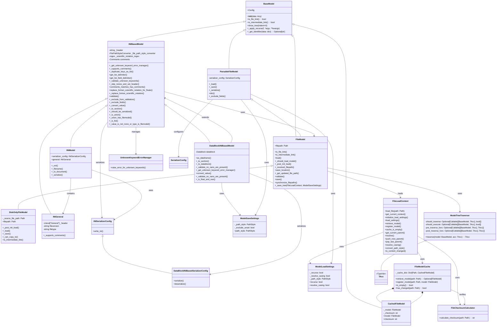

```mermaid

classDiagram
%% Base Classes
    class BaseModel {
        +Config
        +__init__(data: Any)
        +is_file_link(): bool
        +is_intermediate_link(): bool
        +show_tree(indent=0)
        +_apply_recurse(f, *args, **kwargs)
        +_get_identifier(data: dict): Optional[str]
    }

    class FileModel {
        +is_file_link()
        +is_intermediate_link()
        +filepath: Path
        +load()
        +_should_load_model()
        +_post_init_load()
        +_resolved_filepath()
        +save_location()
        +_get_updated_file_path()
        +validate()
        +save()
        +synchronize_filepaths()
        +_save_tree(FileLoadContext, ModelSaveSettings)
    }
    class DiskOnlyFileModel {
        -_source_file_path: Path
        +filepath: Path
        +_post_init_load()
        +_load()
        +_save()
        +_can_copy_to()
        +is_intermediate_link()
    }
    
    class ParsableFileModel{
        -serializer_config: SerializerConfig
        +_load()
        +_save()
        +_serialize()
        +dict()
        +_exclude_fields()
    }

    class INIBasedModel {
        -string _header
        -FilePathStyleConverter _file_path_style_converter
        -regex _scientific_notation_regex
        -Comments comments
        +_get_unknown_keyword_error_manager()
        +_supports_comments()
        +_duplicate_keys_as_list()
        +get_list_delimiter()
        +get_list_field_delimiter()
        +_validate_unknown_keywords()
        +_skip_nones_and_set_header()
        +comments_matches_has_comments()
        +replace_fortran_scientific_notation_for_floats()
        +_replace_fortran_scientific_notation()
        +validate()
        +_exclude_from_validation()
        +_exclude_fields()
        +_convert_value()
        +_to_section()
        +_should_be_serialized()
        +_is_union()
        +_union_has_filemodel()
        +_is_list()
        +_value_is_not_none_or_type_is_filemodel()
    }

    class DataBlockINIBasedModel {
        -Datablock datablock
        +as_dataframe()
        +_to_section()
        +_to_datablock()
        +_validate_no_nans_are_present()
        +_get_unknown_keyword_error_manager()
        +convert_value()
        +_validate_no_nans_are_present()
        +_is_float_and_nan()
    }

    class INIModel {
        +serializer_config: INISerializerConfig
        +general: INIGeneral
        +_ext()
        +_filename()
        +_to_document()
        +_serialize()
    }

    class INIGeneral {
        -Literal["General"] _header
        -string fileversion
        -string filetype
        +_supports_comments()
    }

    class INISerializerConfig {
        +write_ini()
    }

    class DataBlockINIBasedSerializerConfig {
        +serialize()
        +deserialize()
    }

    class ModelSaveSettings {
        -_path_style: PathStyle
        -_exclude_unset: bool
        +path_style: PathStyle
    }

    class ModelLoadSettings {
        -_recurse: bool
        -_resolve_casing: bool
        -_path_style: PathStyle
        +recurse: bool
        +resolve_casing: bool
    }

    class FileLoadContext {
        +load_file(path: Path)
        +get_current_context()
        +initialize_load_settings()
        +load_settings()
        +retrieve_model()
        +register_model()
        +cache_is_empty()
        +get_current_parent()
        +resolve()
        +push_new_parent()
        +pop_last_parent()
        +resolve_casing()
        +convert_path_style()
        +is_content_changed()
    }

    class FileModelCache {
        -_cache_dict: Dict[Path, CachedFileModel]
        +retrieve_model(path: Path): Optional[FileModel]
        +register_model(path: Path, model: FileModel)
        +is_empty(): bool
        +has_changed(path: Path): bool
    }

    class CachedFileModel {
        -_model: FileModel
        -_checksum: str
        +model: FileModel
        +checksum: str
    }
    class ModelTreeTraverser {
        -should_traverse: Optional[Callable[[BaseModel, TAcc], bool]]
        -should_execute: Optional[Callable[[BaseModel, TAcc], bool]]
        -pre_traverse_func: Optional[Callable[[BaseModel, TAcc], TAcc]]
        -post_traverse_func: Optional[Callable[[BaseModel, TAcc], TAcc]]
        +traverse(model: BaseModel, acc: TAcc): TAcc
    }

    class TAcc {
        <<TypeVar>>
    }

%%    class ResolveRelativeMode {
%%        +ToParent: int
%%        +ToAnchor: int
%%    }

%%    class FileCasingResolver {
%%        +resolve(path: Path): Path
%%    }

%%    class FilePathResolver {
%%        -_anchors: List[Path]
%%        -_parents: List[Tuple[Path, ResolveRelativeMode]]
%%        +get_current_parent(): Path
%%        +resolve(path: Path): Path
%%        +push_new_parent(parent_path: Path, relative_mode: ResolveRelativeMode)
%%        +pop_last_parent()
%%    }

    class UnknownKeywordErrorManager {
        +raise_error_for_unknown_keywords()
    }

    class FileChecksumCalculator {
        +calculate_checksum(path: Path): str
    }

%%    class FilePathStyleConverter {
%%        +convert(path: Path, style: PathStyle): Path
%%    }

%%    class OperatingSystem {
%%        +WINDOWS: str
%%        +LINUX: str
%%        +MACOS: str
%%    }

%%    class PathStyle {
%%        +POSIX: str
%%        +WINDOWS: str
%%    }

%% Inheritance Relationships
    FileModel <|-- DiskOnlyFileModel
    
    BaseModel <|-- FileModel
    BaseModel <|-- INIBasedModel
    BaseModel <|-- CachedFileModel
    BaseModel <|-- ParsableFileModel
    ParsableFileModel <|-- FileModel
    
    FileModelCache *-- CachedFileModel
%%    FilePathResolver *-- ResolveRelativeMode
    ModelTreeTraverser o-- TAcc
    
    INIBasedModel <|-- DataBlockINIBasedModel
    INIBasedModel <|-- INIGeneral
    INIBasedModel <|-- INIModel
    INISerializerConfig <|-- DataBlockINIBasedSerializerConfig

%% Associations
    INIBasedModel --> UnknownKeywordErrorManager : manages
%%    INIBasedModel --> FilePathStyleConverter : uses
    INIBasedModel --> INISerializerConfig : serializes
    INIModel --> INIGeneral : contains
    INIModel --> INISerializerConfig : uses
    INIBasedModel --> FileModel : uses
    DataBlockINIBasedModel --> DataBlockINIBasedSerializerConfig : serializes
    DataBlockINIBasedModel --> ModelSaveSettings : uses
    DataBlockINIBasedModel --> INIBasedModel : extends
    FileLoadContext --> ModelLoadSettings : uses
    FileModel --> FileLoadContext : loads

    FileModelCache *-- CachedFileModel
    FileLoadContext --> FileModelCache : uses
    FileLoadContext --> FileChecksumCalculator : uses
    
    ParsableFileModel --> SerializerConfig : configures
    ParsableFileModel --> ModelSaveSettings : uses
    ParsableFileModel --> ModelLoadSettings : uses
%%    ModelSaveSettings --> PathStyle : sets
%%    ModelLoadSettings --> PathStyle : sets
%%    PathStyleValidator --> PathStyle : validates
    FileModelCache --> FileChecksumCalculator : verifies
    FileModel --> ModelTreeTraverser : uses

```