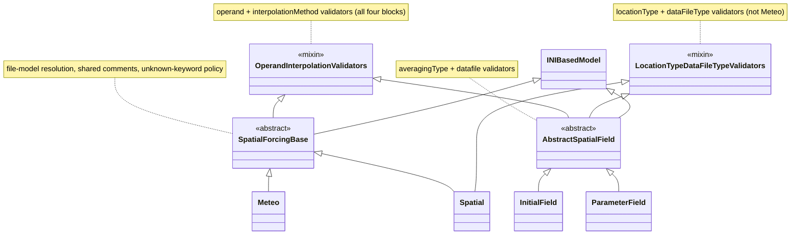

# External forcings file
The external forcing .ext file contains the forcing data for a [D-Flow FM](../../glossary.md#d-flow-fm) model.
This includes open boundaries, lateral discharges, source/sink terms, bubble screens, and meteorological forcings.
The documentation below only concerns the 'new' format (`ExtForceFileNew` in the MDU file).

## Class hierarchy

The `[Meteo]` and `[Spatial]` blocks (this file) and the `[Initial]` / `[Parameter]` blocks
(the [initial field file](inifield.md)) are spatial-field blocks that share their field
validation. The shared logic lives in two plain validator mixins, while `INIBasedModel`
is mixed in only at the two concrete block bases.

Reading the diagram:

- `OperandInterpolationValidators` and `LocationTypeDataFileTypeValidators` are **independent plain
  mixins** (not models, and neither inherits the other). The former holds the `operand` /
  `interpolationMethod` validators shared by all four blocks; the latter holds the `locationType` /
  `dataFileType` validators shared by `Spatial`, `InitialField` and `ParameterField` (not `Meteo`,
  which has neither field).
- `INIBasedModel` is inherited only by the two concrete block bases: `SpatialForcingBase`
  (`Meteo` / `Spatial`) and `AbstractSpatialField` (`InitialField` / `ParameterField`).
- Each block base inherits exactly the validator mixins it needs: `SpatialForcingBase` inherits
  `OperandInterpolationValidators`; `AbstractSpatialField` inherits both mixins; and `Spatial` adds
  `LocationTypeDataFileTypeValidators` on top of `SpatialForcingBase`.
- `averagingType` is validated per-class (`Spatial`, `AbstractSpatialField`) rather than in a shared
  mixin, because `Meteo` reaches `OperandInterpolationValidators` too and stores `averagingType` as a
  raw integer.

## Model
::: hydrolib.core.dflowfm.ext.models
