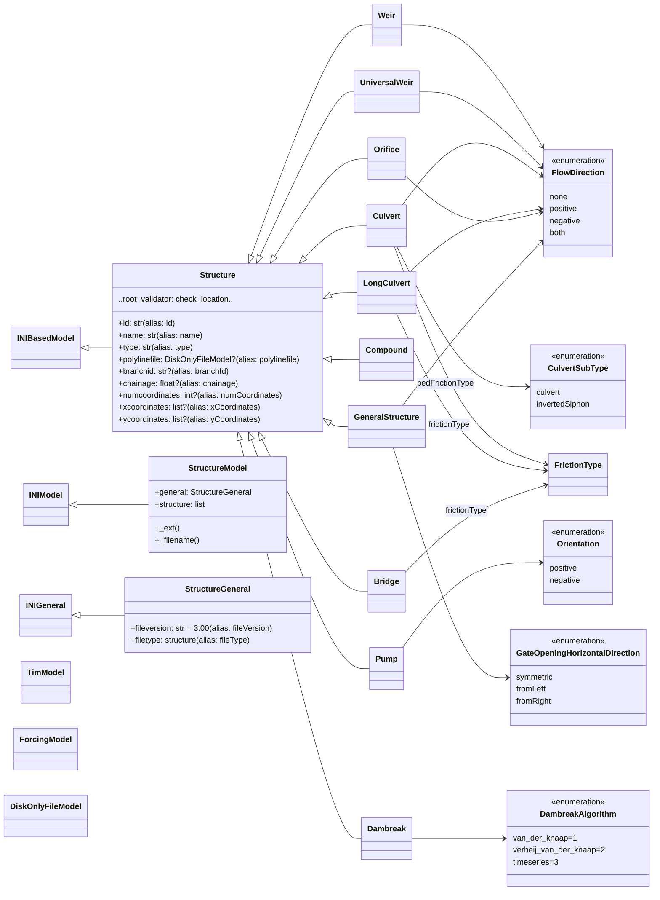
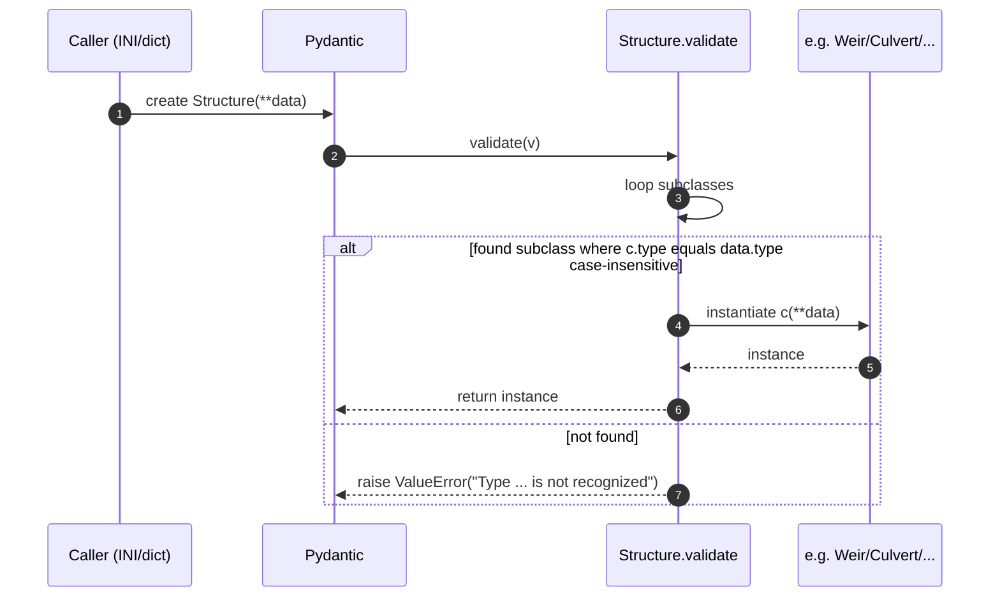
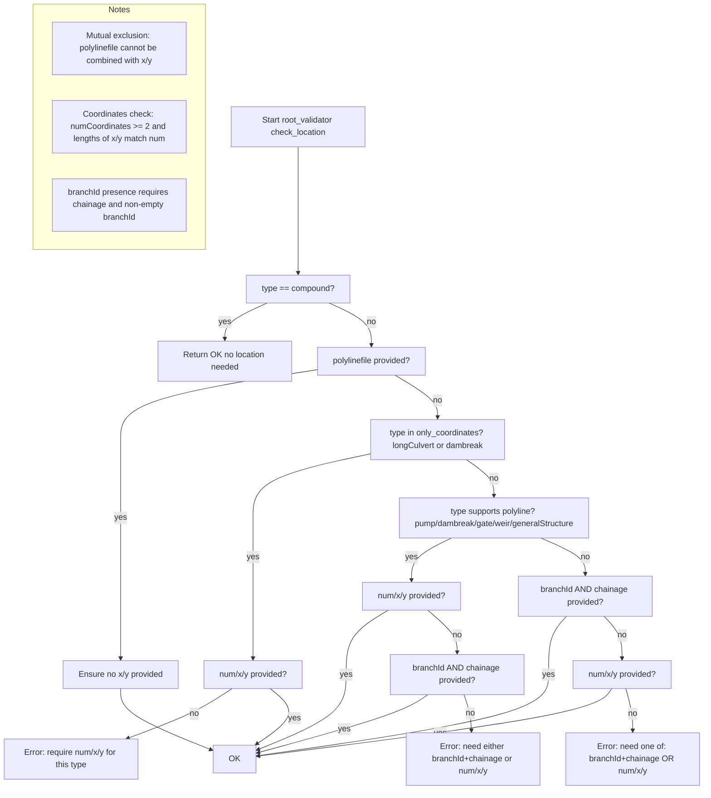
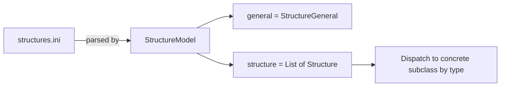
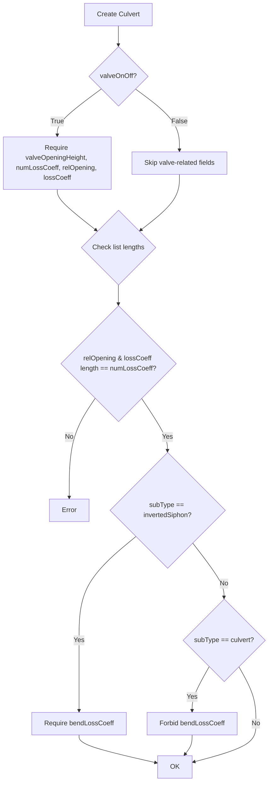
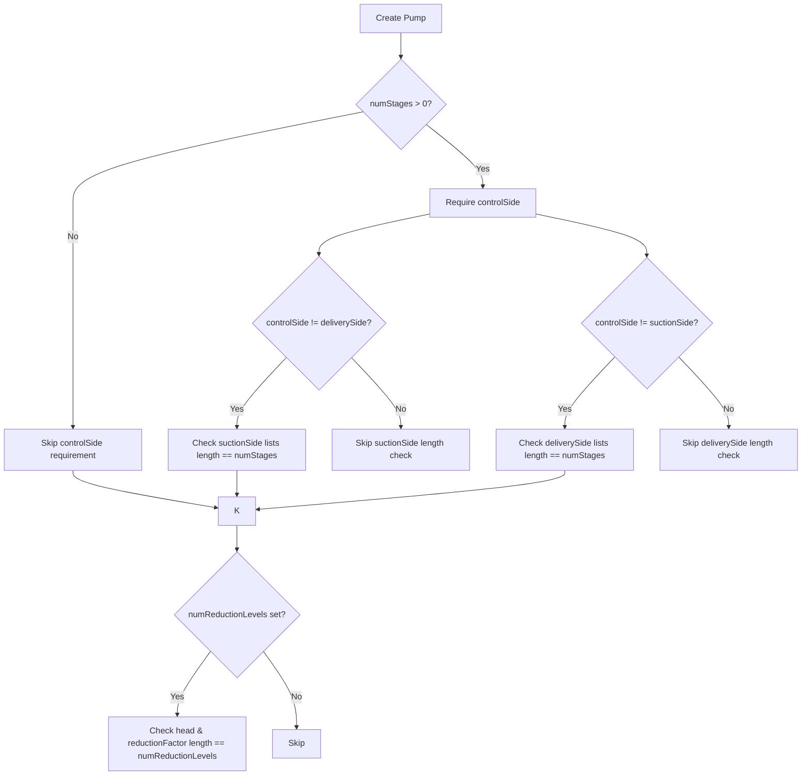
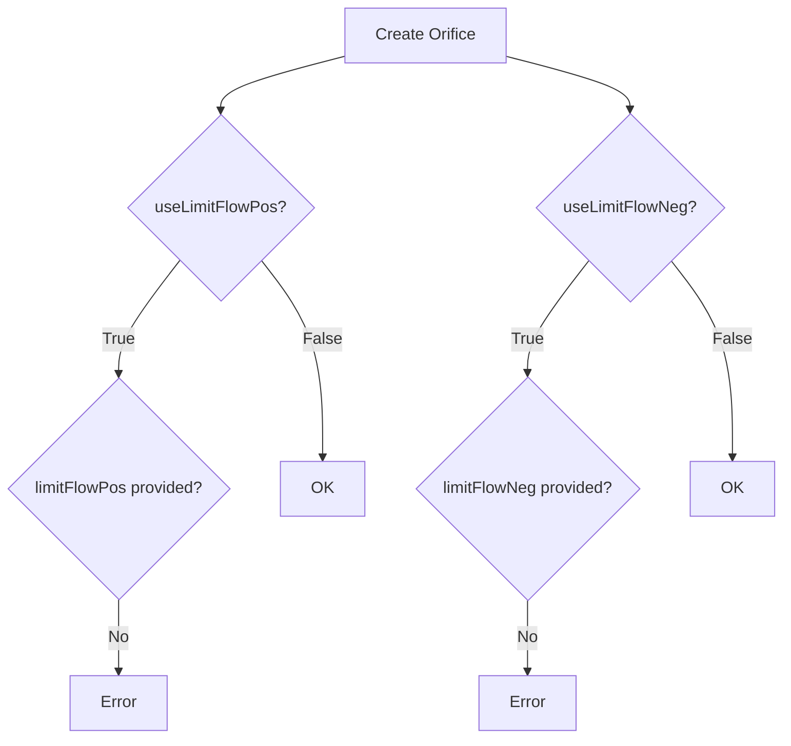
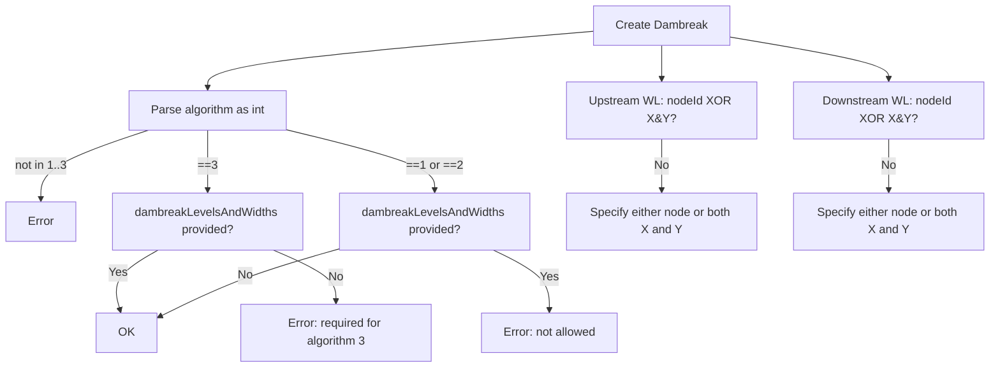

### D-Flow FM Structure Models — Visual Guide

This page provides a visual, diagram-heavy guide to the `hydrolib.core.dflowfm.structure.models` module. It covers:

- Inheritance and relationships between all classes
- Attributes of each class (with aliases as used in INI files)
- Validation logic and decision flows during model construction
- How the models map to the D-Flow FM structure `.ini` file

All diagrams use Mermaid. You can pan/zoom diagrams with Ctrl+mouse (enabled in this documentation site).

Note: Field names shown in lowercase are the Python attribute names. For each field we list the INI alias used on disk (camelCase or otherwise) where applicable.

### Module overview



#### Type alias used across models

```
# Union of supported time-varying or static forcing inputs
ForcingData = float | TimModel | ForcingModel
```

### How subclass selection works (factory behavior)

When deserializing a `[Structure]` block from an INI file or a Python `dict`, the base `Structure` model auto-selects the correct subclass by looking at the (case-insensitive) `type` field:



### Location specification logic (shared by most structures)

This logic runs in `Structure.check_location` for most subclasses. `Compound` structures are exempt.



Important details enforced by code:

- polylinefile and x/y coordinates are mutually exclusive.
- For `longCulvert`, coordinates must be provided if no polyline is given. For `dambreak`, either coordinates or polyline is allowed.
- At least one of: branchId+chainage OR num/x/y OR polylinefile must be present (except for `compound`).
- `validate_coordinates_in_model` enforces `numCoordinates >= 2` and exact length match for `xCoordinates` and `yCoordinates`.
- `validate_branch_and_chainage_in_model` ensures that when `branchId` is provided, `chainage` is provided and `branchId` is non-empty.

### StructureModel and INI mapping



The `StructureModel` represents an entire `structures.ini` file with:

- `[General]` section mapping to `StructureGeneral`
- One or more `[Structure]` sections mapping to the `Structure` subclasses

On save/export, non-applicable location fields are excluded via `Structure._exclude_fields()`:

- If `type == "compound"`: branch/chainage and coordinate fields are excluded.
- If `branchId` is set: coordinate fields are excluded.
- Else: branch/chainage fields are excluded.

### Class-by-class data dictionary

Below are concise, code-like summaries of the attributes for each class, including INI aliases and defaults. Types marked with `?` are optional.

#### Base: Structure

```
class Structure(INIBasedModel):
    id: str = Field("id", alias="id", max_length=256)
    name: str = Field("id", alias="name")
    type: str = Field(alias="type")

    # Location A: 2D polyline
    polylinefile: DiskOnlyFileModel | None = Field(None, alias="polylinefile")

    # Location B: 1D branch reference
    branchid: str | None = Field(None, alias="branchId")
    chainage: float | None = Field(None, alias="chainage")

    # Location C: explicit coordinates
    numcoordinates: int | None = Field(None, alias="numCoordinates")
    xcoordinates: list[float] | None = Field(None, alias="xCoordinates")
    ycoordinates: list[float] | None = Field(None, alias="yCoordinates")

    # Validators:
    # - check_location (root): enforces location rules (see flow above)
    # - validate_branch_and_chainage_in_model (static): branchId/chainage checks
    # - validate_coordinates_in_model (static): num/x/y checks
    # - validate (class): factory to instantiate proper subclass from type
```

#### Enums

```
class FlowDirection(StrEnum):
    none = "none"; positive = "positive"; negative = "negative"; both = "both"

class Orientation(StrEnum):
    positive = "positive"; negative = "negative"

class GateOpeningHorizontalDirection(StrEnum):
    symmetric = "symmetric"; from_left = "fromLeft"; from_right = "fromRight"

class CulvertSubType(StrEnum):
    culvert = "culvert"; invertedSiphon = "invertedSiphon"

class DambreakAlgorithm(int, Enum):
    van_der_knaap = 1; verheij_van_der_knaap = 2; timeseries = 3
    @property def description(self) -> str: ...
```

#### Weir (type = weir)

```
class Weir(Structure):
    type: Literal["weir"] = Field("weir", alias="type")
    allowedflowdir: FlowDirection | None = Field(FlowDirection.both.value,
                                                 alias="allowedFlowDir")
    crestlevel: ForcingData = Field(alias="crestLevel")
    crestwidth: float | None = Field(None, alias="crestWidth")
    corrcoeff: float = Field(1.0, alias="corrCoeff")
    usevelocityheight: bool = Field(True, alias="useVelocityHeight")
```

#### UniversalWeir (type = universalWeir)

```
class UniversalWeir(Structure):
    type: Literal["universalWeir"] = Field("universalWeir", alias="type")
    allowedflowdir: FlowDirection = Field(alias="allowedFlowDir")

    numlevels: int = Field(alias="numLevels")
    yvalues: list[float] = Field(alias="yValues")
    zvalues: list[float] = Field(alias="zValues")
    crestlevel: float = Field(alias="crestLevel")
    dischargecoeff: float = Field(alias="dischargeCoeff")

    # Validation: yvalues/zvalues are split from delimited strings; lengths must match numlevels
```

#### Culvert (type = culvert)

```
class Culvert(Structure):
    type: Literal["culvert"] = Field("culvert", alias="type")
    allowedflowdir: FlowDirection = Field(alias="allowedFlowDir")

    leftlevel: float = Field(alias="leftLevel")
    rightlevel: float = Field(alias="rightLevel")
    csdefid: str = Field(alias="csDefId")
    length: float = Field(alias="length")
    inletlosscoeff: float = Field(alias="inletLossCoeff")
    outletlosscoeff: float = Field(alias="outletLossCoeff")
    valveonoff: bool = Field(alias="valveOnOff")
    valveopeningheight: ForcingData | None = Field(alias="valveOpeningHeight")
    numlosscoeff: int | None = Field(alias="numLossCoeff")
    relopening: list[float] | None = Field(alias="relOpening")
    losscoeff: list[float] | None = Field(alias="lossCoeff")
    bedfrictiontype: FrictionType | None = Field(alias="bedFrictionType")
    bedfriction: float | None = Field(alias="bedFriction")
    subtype: CulvertSubType | None = Field(CulvertSubType.culvert.value, alias="subType")
    bendlosscoeff: float | None = Field(alias="bendLossCoeff")

    # Validators:
    # - If valveonoff==True -> require: valveopeningheight, numlosscoeff, relopening, losscoeff
    # - If subtype==invertedSiphon -> require: bendlosscoeff
    # - If subtype==culvert -> forbid: bendlosscoeff
    # - relopening/losscoeff lists must have length numlosscoeff
```

Validation flow for valves and subtype:



#### LongCulvert (type = longCulvert)

```
class LongCulvert(Structure):
    type: Literal["longCulvert"] = Field("longCulvert", alias="type")
    allowedflowdir: FlowDirection | None = Field(alias="allowedFlowDir")
    zcoordinates: list[float] | None = Field(None, alias="zCoordinates")

    width: float = Field(alias="width")
    height: float = Field(alias="height")
    frictiontype: FrictionType = Field(alias="frictionType")
    frictionvalue: float = Field(alias="frictionValue")
    valverelativeopening: float = Field(alias="valveRelativeOpening")
    csdefid: str | None = Field(alias="csDefId")

    # Validator: if zcoordinates given -> len(zcoordinates) must equal numCoordinates
```

#### Pump (type = pump)

```
class Pump(Structure):
    type: Literal["pump"] = Field("pump", alias="type")
    orientation: Orientation | None = Field(alias="orientation")
    controlside: str | None = Field(alias="controlSide")
    numstages: int | None = Field(alias="numStages")
    capacity: ForcingData = Field(alias="capacity")

    startlevelsuctionside: list[float] | None = Field(alias="startLevelSuctionSide")
    stoplevelsuctionside: list[float] | None = Field(alias="stopLevelSuctionSide")
    startleveldeliveryside: list[float] | None = Field(alias="startLevelDeliverySide")
    stopleveldeliveryside: list[float] | None = Field(alias="stopLevelDeliverySide")
    numreductionlevels: int | None = Field(alias="numReductionLevels")
    head: list[float] | None = Field(alias="head")
    reductionfactor: list[float] | None = Field(alias="reductionFactor")

    # Validators:
    # - If numStages > 0 -> controlSide required
    # - Lengths of start/stop lists equal numStages (conditionally, based on controlSide)
    # - Lengths of head/reductionFactor equal numReductionLevels
```

Validation conditions for Pump lists:



#### Compound (type = compound)

```
class Compound(Structure):
    type: Literal["compound"] = Field("compound", alias="type")
    numstructures: int = Field(alias="numStructures")
    structureids: list[str] = Field(alias="structureIds", delimiter=";")

    # Location: not required (base validator short-circuits for compound)
```

#### Orifice (type = orifice)

```
class Orifice(Structure):
    type: Literal["orifice"] = Field("orifice", alias="type")
    allowedflowdir: FlowDirection | None = Field(FlowDirection.both.value,
                                                 alias="allowedFlowDir")

    crestlevel: ForcingData = Field(alias="crestLevel")
    crestwidth: float | None = Field(None, alias="crestWidth")
    gateloweredgelevel: ForcingData = Field(alias="gateLowerEdgeLevel")
    corrcoeff: float = Field(1.0, alias="corrCoeff")
    usevelocityheight: bool = Field(True, alias="useVelocityHeight")

    uselimitflowpos: bool | None = Field(False, alias="useLimitFlowPos")
    limitflowpos: float | None = Field(alias="limitFlowPos")
    uselimitflowneg: bool | None = Field(False, alias="useLimitFlowNeg")
    limitflowneg: float | None = Field(alias="limitFlowNeg")

    # Validators: if useLimitFlowPos/Neg==True -> corresponding limitFlow* must be provided
```

Validation logic for limit flow:



#### GeneralStructure (type = generalStructure)

```
class GeneralStructure(Structure):
    type: Literal["generalStructure"] = Field("generalStructure", alias="type")
    allowedflowdir: FlowDirection | None = Field(FlowDirection.both.value,
                                                 alias="allowedFlowDir")

    upstream1width: float | None = Field(10.0, alias="upstream1Width")
    upstream1level: float | None = Field(0.0, alias="upstream1Level")
    upstream2width: float | None = Field(10.0, alias="upstream2Width")
    upstream2level: float | None = Field(0.0, alias="upstream2Level")

    crestwidth: float | None = Field(10.0, alias="crestWidth")
    crestlevel: ForcingData | None = Field(0.0, alias="crestLevel")
    crestlength: float | None = Field(0.0, alias="crestLength")

    downstream1width: float | None = Field(10.0, alias="downstream1Width")
    downstream1level: float | None = Field(0.0, alias="downstream1Level")
    downstream2width: float | None = Field(10.0, alias="downstream2Width")
    downstream2level: float | None = Field(0.0, alias="downstream2Level")

    gateloweredgelevel: ForcingData | None = Field(11.0, alias="gateLowerEdgeLevel")
    posfreegateflowcoeff: float | None = Field(1.0, alias="posFreeGateFlowCoeff")
    posdrowngateflowcoeff: float | None = Field(1.0, alias="posDrownGateFlowCoeff")
    posfreeweirflowcoeff: float | None = Field(1.0, alias="posFreeWeirFlowCoeff")
    posdrownweirflowcoeff: float | None = Field(1.0, alias="posDrownWeirFlowCoeff")
    poscontrcoeffreegate: float | None = Field(1.0, alias="posContrCoefFreeGate")
    negfreegateflowcoeff: float | None = Field(1.0, alias="negFreeGateFlowCoeff")
    negdrowngateflowcoeff: float | None = Field(1.0, alias="negDrownGateFlowCoeff")
    negfreeweirflowcoeff: float | None = Field(1.0, alias="negFreeWeirFlowCoeff")
    negdrownweirflowcoeff: float | None = Field(1.0, alias="negDrownWeirFlowCoeff")
    negcontrcoeffreegate: float | None = Field(1.0, alias="negContrCoefFreeGate")
    extraresistance: float | None = Field(0.0, alias="extraResistance")
    gateheight: float | None = Field(1e10, alias="gateHeight")
    gateopeningwidth: ForcingData | None = Field(0.0, alias="gateOpeningWidth")
    gateopeninghorizontaldirection: GateOpeningHorizontalDirection | None = 
        Field(GateOpeningHorizontalDirection.symmetric.value,
              alias="gateOpeningHorizontalDirection")
    usevelocityheight: bool | None = Field(True, alias="useVelocityHeight")
```

#### Dambreak (type = dambreak)

```
class Dambreak(Structure):
    type: Literal["dambreak"] = Field("dambreak", alias="type")
    startlocationx: float = Field(alias="startLocationX")
    startlocationy: float = Field(alias="startLocationY")
    algorithm: DambreakAlgorithm = Field(alias="algorithm")

    crestlevelini: float = Field(alias="crestLevelIni")
    breachwidthini: float = Field(alias="breachWidthIni")
    crestlevelmin: float = Field(alias="crestLevelMin")
    t0: float = Field(alias="t0")
    timetobreachtomaximumdepth: float = Field(alias="timeToBreachToMaximumDepth")
    f1: float = Field(alias="f1")
    f2: float = Field(alias="f2")
    ucrit: float = Field(alias="uCrit")

    # Optional custom water level locations (either XY or nodeId per side)
    waterlevelupstreamlocationx: float | None = Field(alias="waterLevelUpstreamLocationX")
    waterlevelupstreamlocationy: float | None = Field(alias="waterLevelUpstreamLocationY")
    waterleveldownstreamlocationx: float | None = Field(alias="waterLevelDownstreamLocationX")
    waterleveldownstreamlocationy: float | None = Field(alias="waterLevelDownstreamLocationY")
    waterlevelupstreamnodeid: str | None = Field(alias="waterLevelUpstreamNodeId")
    waterleveldownstreamnodeid: str | None = Field(alias="waterLevelDownstreamNodeId")

    # Only for algorithm=3
    dambreaklevelsandwidths: TimModel | ForcingModel | None = Field(alias="dambreakLevelsAndWidths")

    # Validators:
    # - algorithm: coerce to int and require 1..3
    # - dambreakLevelsAndWidths only allowed when algorithm == 3
    # - For each side (upstream/downstream): either (X & Y) or (NodeId), but not both
```

Algorithm-specific checks:



#### Bridge (type = bridge)

```
class Bridge(Structure):
    type: Literal["bridge"] = Field("bridge", alias="type")
    allowedflowdir: FlowDirection = Field(alias="allowedFlowdir")

    csdefid: str = Field(alias="csDefId")
    shift: float
    inletlosscoeff: float = Field(alias="inletLossCoeff")
    outletlosscoeff: float = Field(alias="outletLossCoeff")
    frictiontype: FrictionType = Field(alias="frictionType")
    friction: float
    length: float
```

#### File-level models

```
class StructureGeneral(INIGeneral):
    _header: Literal["General"] = "General"
    fileversion: str = Field("3.00", alias="fileVersion")
    filetype: Literal["structure"] = Field("structure", alias="fileType")

class StructureModel(INIModel):
    general: StructureGeneral = StructureGeneral()
    structure: list[Structure] = []

    @classmethod
    def _ext(cls) -> str: return ".ini"
    @classmethod
    def _filename(cls) -> str: return "structures"
```

### Attribute validation helpers (from INI utilities)

These utility functions are used extensively in validators throughout the models:

- `get_enum_validator(field, enum=...)`: wires a Pydantic validator that checks values against a given enum and supports string inputs.
- `get_split_string_on_delimiter_validator(...)`: allows comma- or semicolon-delimited strings in INI files to become Python lists on load.
- `validate_required_fields(values, *required, conditional_field_name, conditional_value, comparison_func=...)`: require specific fields when a condition holds.
- `validate_forbidden_fields(values, *forbidden, conditional_field_name, conditional_value)`: forbid fields under certain conditions.
- `validate_correct_length(values, list_a, list_b, length_name, list_required_with_length=True)`: enforce list lengths match a given length field.
- `validate_conditionally(cls, values, fn, condition_field, unequal_to_value, comparator)`: run a check function only when a condition holds (used for Pump side-specific list checks).

### Quick usage example

```
from hydrolib.core.dflowfm.structure.models import StructureModel, Weir

# Load an existing structures.ini
sm = StructureModel(filepath="path/to/structures.ini")

# Add a simple Weir defined by branch+chainage
sm.structure.append(
    Weir(
        id="W1",
        name="Upstream Weir",
        branchId="MainBranch",
        chainage=1234.5,
        crestLevel=1.2,
        crestWidth=5.0,
    )
)

# Save back to disk
sm.save("path/to/structures.ini")
```

### Notes and edge cases

- `Compound` structures do not require any location specification; the base location validator exits early for `type="compound"`.
- The location logic forbids combining `polylinefile` with explicit `xCoordinates`/`yCoordinates`.
- For `LongCulvert`, if you provide `zCoordinates` it must have exactly `numCoordinates` entries.
- For `Dambreak`, upstream and downstream water level reference can be either a node id or an (X,Y) pair per side, but not both; each side is validated independently.
- The base `Structure._exclude_fields()` ensures only the relevant location fields are written out, keeping INI files clean.

### How to include this page in your docs navigation

Add an entry under “D-Flow FM” in `mkdocs.yml` (or in any section you prefer):

```
nav:
  - API Reference:
      - D-Flow FM:
          - Structures:
              - reference/dflowfm/structure/models-diagrams.md
```

This page assumes Mermaid support is enabled (it is already configured via `pymdownx.superfences` with a custom `mermaid` fence in this repository’s `mkdocs.yml`).
