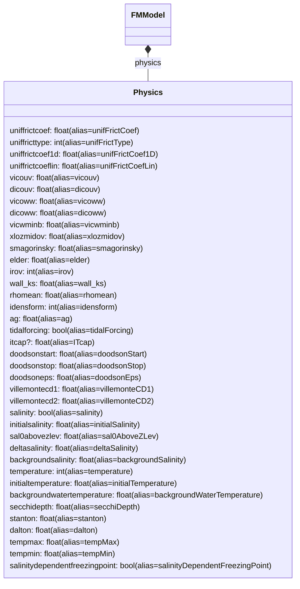
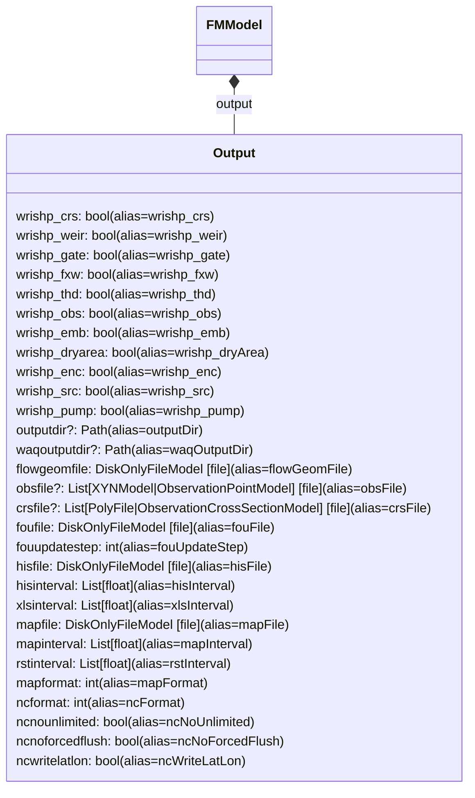
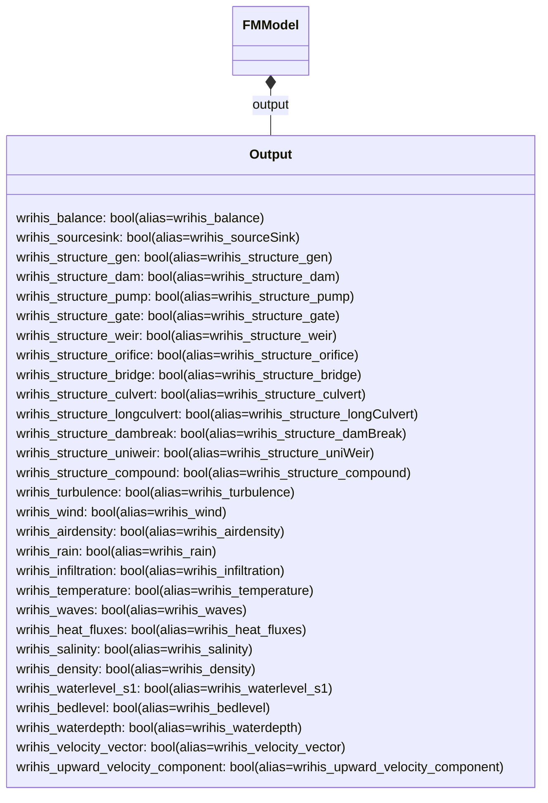
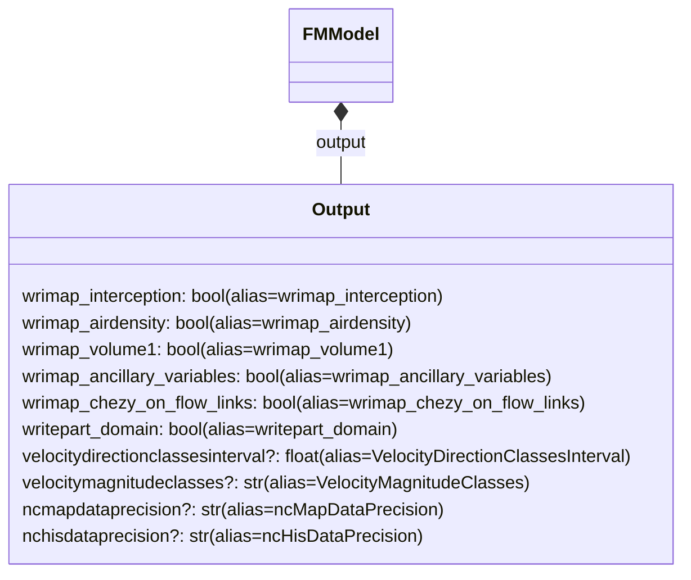

# FMModel attributes: detailed class diagrams

This page provides detailed Mermaid class diagrams for all `FMModel` sections with their properties. It complements the high‑level overview on the consolidated diagram page and is split into multiple diagrams to keep rendering fast and readable. Each diagram explicitly includes the `FMModel` node and connects it to the section(s) shown, mirroring the consolidated overview so that every diagram is self‑contained and "connected" back to `FMModel`.

Legend

- Property notation: `name: Type (alias=OnDiskKey)`
- Optional fields are marked with `?` after the name: `name?: Type (alias=...)`
- File-linked fields (implementations of `FileModel` or file path wrappers) are annotated with `[file]` after the type.

Links

- High-level overview: fmmodel-attributes-overview.md
- FMModel source: hydrolib.core.dflowfm.mdu.models.FMModel

---

## Core sections (compact)

```mermaid
classDiagram
    direction TB

    class General {
      program: str (alias=program)
      version: str (alias=version)
      filetype: "modelDef" (alias=fileType)
      fileversion: str (alias=fileVersion)
      autostart?: AutoStartOption (alias=autoStart)
      pathsrelativetoparent: bool (alias=pathsRelativeToParent)
      guiversion?: str (alias=guiVersion)
    }

    class VolumeTables {
      usevolumetables: bool (alias=useVolumeTables)
      increment: float (alias=increment)
      usevolumetablefile: bool (alias=useVolumeTableFile)
    }

    class Sediment {
      sedimentmodelnr?: int (alias=Sedimentmodelnr)
      morfile: DiskOnlyFileModel [file] (alias=MorFile)
      sedfile: DiskOnlyFileModel [file] (alias=SedFile)
    }

    class Wind {
      icdtyp: int (alias=iCdTyp)
      cdbreakpoints: List[float] (alias=CdBreakpoints)
      windspeedbreakpoints: List[float] (alias=windSpeedBreakpoints)
      rhoair: float (alias=rhoAir)
      relativewind: float (alias=relativeWind)
      windpartialdry: bool (alias=windPartialDry)
      pavbnd: float (alias=pavBnd)
      pavini: float (alias=pavIni)
      computedairdensity: bool (alias=computedAirdensity)
      rhowaterinwindstress: int (alias=rhoWaterInWindStress)
      stresstowind: bool (alias=stressToWind)
    }

    class Waves {
      wavemodelnr: int (alias=waveModelNr)
      rouwav: str (alias=rouWav)
      gammax: float (alias=gammaX)
    }

    class Time {
      refdate: int (alias=refDate)
      tzone: float (alias=tZone)
      tunit: str (alias=tUnit)
      dtuser: float (alias=dtUser)
      dtnodal: float (alias=dtNodal)
      dtmax: float (alias=dtMax)
      dtinit: float (alias=dtInit)
      autotimestep?: int (alias=autoTimestep)
      autotimestepnostruct: bool (alias=autoTimestepNoStruct)
      autotimestepnoqout: bool (alias=autoTimestepNoQout)
      tstart: float (alias=tStart)
      tstop: float (alias=tStop)
      startdatetime?: str (alias=startDateTime)
      stopdatetime?: str (alias=stopDateTime)
      updateroughnessinterval: float (alias=updateRoughnessInterval)
      dtfacmax: float (alias=Dtfacmax)
    }

    class Restart {
      restartfile: DiskOnlyFileModel [file] (alias=restartFile)
      restartdatetime?: str (alias=restartDateTime)
    }

    class ExternalForcing {
      extforcefile?: ExtOldModel [file] (alias=extForceFile)
      extforcefilenew?: ExtModel [file] (alias=extForceFileNew)
      rainfall?: bool (alias=rainfall)
      qext?: bool (alias=qExt)
      evaporation?: bool (alias=evaporation)
      windext?: int (alias=windExt)
    }

    class Hydrology {
      interceptionmodel: bool (alias=interceptionModel)
    }

    class Trachytopes {
      trtrou: str (alias=trtRou)
      trtdef?: Path [file] (alias=trtDef)
      trtl?: Path [file] (alias=trtL)
      dttrt: float (alias=dtTrt)
      trtmxr?: int (alias=trtMxR)
    }

    %% Connect to FMModel like in the consolidated overview
    class FMModel
    FMModel *-- General : general
    FMModel *-- VolumeTables : volumetables
    FMModel *-- Sediment : sediment
    FMModel *-- Wind : wind
    FMModel -- Waves : waves (optional)
    FMModel *-- Time : time
    FMModel *-- Restart : restart
    FMModel *-- ExternalForcing : external_forcing
    FMModel *-- Hydrology : hydrology
    FMModel *-- Trachytopes : trachytopes
```

---

## Geometry section (complete properties)

```mermaid
classDiagram
    direction TB

    class Geometry {
      netfile?: NetworkModel [file] (alias=netFile)
      bathymetryfile?: XYZModel [file] (alias=bathymetryFile)
      drypointsfile?: List[XYZModel|PolyFile] [file] (alias=dryPointsFile)
      structurefile?: List[StructureModel] [file] (alias=structureFile)
      inifieldfile?: IniFieldModel [file] (alias=iniFieldFile)
      waterlevinifile: DiskOnlyFileModel [file] (alias=waterLevIniFile)
      landboundaryfile?: List[DiskOnlyFileModel] [file] (alias=landBoundaryFile)
      thindamfile?: List[PolyFile] [file] (alias=thinDamFile)
      fixedweirfile?: List[PolyFile] [file] (alias=fixedWeirFile)
      pillarfile?: List[PolyFile] [file] (alias=pillarFile)
      usecaching: bool (alias=useCaching)
      vertplizfile?: PolyFile [file] (alias=vertPlizFile)
      frictfile?: List[FrictionModel] [file] (alias=frictFile)
      crossdeffile?: CrossDefModel [file] (alias=crossDefFile)
      crosslocfile?: CrossLocModel [file] (alias=crossLocFile)
      storagenodefile?: StorageNodeModel [file] (alias=storageNodeFile)
      oned2dlinkfile: DiskOnlyFileModel [file] (alias=1d2dLinkFile)
      proflocfile: DiskOnlyFileModel [file] (alias=profLocFile)
      profdeffile: DiskOnlyFileModel [file] (alias=profDefFile)
      profdefxyzfile: DiskOnlyFileModel [file] (alias=profDefXyzFile)
      manholefile: DiskOnlyFileModel [file] (alias=manholeFile)
      partitionfile?: PolyFile [file] (alias=partitionFile)
      uniformwidth1d: float (alias=uniformWidth1D)
      dxwuimin2d: float (alias=dxWuiMin2D)
      waterlevini: float (alias=waterLevIni)
      bedlevuni: float (alias=bedLevUni)
      bedslope: float (alias=bedSlope)
      bedlevtype: int (alias=bedLevType)
      blmeanbelow: float (alias=blMeanBelow)
      blminabove: float (alias=blMinAbove)
      anglat: float (alias=angLat)
      anglon: float (alias=angLon)
      conveyance2d: int (alias=conveyance2D)
      nonlin1d: int (alias=nonlin1D)
      nonlin2d: int (alias=nonlin2D)
      sillheightmin: float (alias=sillHeightMin)
      makeorthocenters: bool (alias=makeOrthoCenters)
      dcenterinside: float (alias=dCenterInside)
      bamin: float (alias=baMin)
      openboundarytolerance: float (alias=openBoundaryTolerance)
      renumberflownodes: bool (alias=renumberFlowNodes)
      kmx: int (alias=kmx)
      layertype: int (alias=layerType)
      numtopsig: int (alias=numTopSig)
      numtopsiguniform: bool (alias=numTopSigUniform)
      sigmagrowthfactor: float (alias=sigmaGrowthFactor)
      dztop?: float (alias=dzTop)
      floorlevtoplay?: float (alias=floorLevTopLay)
      dztopuniabovez?: float (alias=dzTopUniAboveZ)
      keepzlayeringatbed: int (alias=keepZLayeringAtBed)
      dxdoubleat1dendnodes: bool (alias=dxDoubleAt1DEndNodes)
      changevelocityatstructures: bool (alias=changeVelocityAtStructures)
      changestructuredimensions: bool (alias=changeStructureDimensions)
      gridenclosurefile?: PolyFile [file] (alias=gridEnclosureFile)
      allowbndatbifurcation: bool (alias=allowBndAtBifurcation)
      slotw1d: float (alias=slotw1D)
      slotw2d: float (alias=slotw2D)
      uniformheight1droofgutterpipes: float (alias=uniformHeight1DRoofGutterPipes)
      dxmin1d: float (alias=dxmin1D)
      uniformtyp1dstreetinlets: int (alias=uniformTyp1DStreetInlets)
      stretchtype: int (alias=stretchType)
      zlaybot: float (alias=zlayBot)
      zlaytop: float (alias=zlayTop)
      uniformheight1d: float (alias=uniformHeight1D)
      roofsfile?: PolyFile [file] (alias=roofsFile)
      gulliesfile?: PolyFile [file] (alias=gulliesFile)
      uniformwidth1dstreetinlets: float (alias=uniformWidth1DStreetInlets)
      uniformheight1dstreetinlets: float (alias=uniformHeight1DStreetInlets)
      uniformtyp1droofgutterpipes: int (alias=uniformTyp1DRoofGutterPipes)
      uniformwidth1droofgutterpipes: float (alias=uniformWidth1DRoofGutterPipes)
    }

    %% Connect to FMModel like in the consolidated overview
    class FMModel
    FMModel *-- Geometry : geometry
```

---

## Numerics section (complete properties)

```mermaid
classDiagram
    direction TB

    class Numerics {
      cflmax: float (alias=CFLMax)
      epsmaxlev: float (alias=EpsMaxlev)
      epsmaxlevm: float (alias=EpsMaxlevM)
      advectype: int (alias=advecType)
      timesteptype: int (alias=timeStepType)
      limtyphu: int (alias=limTypHu)
      limtypmom: int (alias=limTypMom)
      limtypsa: int (alias=limTypSa)
      icgsolver: int (alias=icgSolver)
      maxdegree: int (alias=maxDegree)
      fixedweirscheme: int (alias=fixedWeirScheme)
      fixedweircontraction: float (alias=fixedWeirContraction)
      izbndpos: int (alias=izBndPos)
      tlfsmo: float (alias=tlfSmo)
      keepstbndonoutflow: bool (alias=keepSTBndOnOutflow)
      slopedrop2d: float (alias=slopeDrop2D)
      drop1d: bool (alias=drop1D)
      chkadvd: float (alias=chkAdvd)
      teta0: float (alias=teta0)
      qhrelax: float (alias=qhRelax)
      cstbnd: bool (alias=cstBnd)
      maxitverticalforestersal: int (alias=maxitVerticalForesterSal)
      maxitverticalforestertem: int (alias=maxitVerticalForesterTem)
      turbulencemodel: int (alias=turbulenceModel)
      turbulenceadvection: int (alias=turbulenceAdvection)
      anticreep: bool (alias=antiCreep)
      baroczlaybed?: bool (alias=barocZLayBed)
      barocponbnd: bool (alias=barocPOnBnd)
      maxwaterleveldiff: float (alias=maxWaterLevelDiff)
      maxvelocitydiff: float (alias=maxVelocityDiff)
      mintimestepbreak: float (alias=minTimestepBreak)
      epshu: float (alias=epsHu)
      fixedweirrelaxationcoef: float (alias=fixedWeirRelaxationCoef)
      implicitdiffusion2d: bool (alias=implicitDiffusion2D)
      vertadvtyptem: int (alias=vertAdvTypTem)
      velmagnwarn: float (alias=velMagnWarn)
      transportautotimestepdiff: int (alias=transportAutoTimestepDiff)
      sethorizontalbobsfor1d2d: bool (alias=setHorizontalBobsFor1D2D)
      diagnostictransport: bool (alias=diagnosticTransport)
      vertadvtypsal: int (alias=vertAdvTypSal)
      zerozbndinflowadvection: int (alias=zeroZBndInflowAdvection)
      pure1d: int (alias=pure1D)
      testdryingflooding: int (alias=testDryingFlooding)
      logsolverconvergence: bool (alias=logSolverConvergence)
      fixedweirscheme1d2d: int (alias=fixedWeirScheme1D2D)
      horizontalmomentumfilter: bool (alias=horizontalMomentumFilter)
      maxnonlineariterations: int (alias=maxNonLinearIterations)
      maxvelocity: float (alias=maxVelocity)
      waterlevelwarn: float (alias=waterLevelWarn)
      tspinupturblogprof: float (alias=tSpinUpTurbLogProf)
      fixedweirtopfrictcoef?: float (alias=fixedWeirTopFrictCoef)
      fixedweir1d2d_dx: float (alias=fixedWeir1D2D_dx)
      junction1d: int (alias=junction1D)
      fixedweirtopwidth: float (alias=fixedWeirTopWidth)
      vertadvtypmom: int (alias=vertAdvTypMom)
      checkerboardmonitor: bool (alias=checkerboardMonitor)
      velocitywarn: float (alias=velocityWarn)
      adveccorrection1d2d: int (alias=advecCorrection1D2D)
      fixedweirtalud: float (alias=fixedWeirTalud)
      lateral_fixedweir_umin: float (alias=lateral_fixedweir_umin)
      jasfer3d: bool (alias=jasfer3D)
    }

    %% Connect to FMModel like in the consolidated overview
    class FMModel
    FMModel *-- Numerics : numerics
```

---

## Physics section (complete properties)

---

## Optional sections (complete properties)

```mermaid
classDiagram
    direction TB

    class Calibration {
      usecalibration: bool (alias=UseCalibration)
      definitionfile: DiskOnlyFileModel [file] (alias=DefinitionFile)
      areafile: DiskOnlyFileModel [file] (alias=AreaFile)
    }

    class GroundWater {
      groundwater?: bool (alias=GroundWater)
      infiltrationmodel?: InfiltrationMethod (alias=Infiltrationmodel)
      hinterceptionlayer?: float (alias=Hinterceptionlayer)
      unifinfiltrationcapacity?: float (alias=UnifInfiltrationCapacity)
      conductivity?: float (alias=Conductivity)
      h_aquiferuni?: float (alias=h_aquiferuni)
      bgrwuni?: float (alias=bgrwuni)
      h_unsatini?: float (alias=h_unsatini)
      sgrwini?: float (alias=sgrwini)
    }

    class Processes {
      substancefile: DiskOnlyFileModel [file] (alias=SubstanceFile)
      additionalhistoryoutputfile: DiskOnlyFileModel [file] (alias=AdditionalHistoryOutputFile)
      statisticsfile: DiskOnlyFileModel [file] (alias=StatisticsFile)
      thetavertical?: float (alias=ThetaVertical)
      dtprocesses?: float (alias=DtProcesses)
      processfluxintegration?: ProcessFluxIntegration (alias=ProcessFluxIntegration)
      wriwaqbot3doutput?: bool (alias=Wriwaqbot3Doutput)
      volumedrythreshold?: float (alias=VolumeDryThreshold)
      depthdrythreshold?: float (alias=DepthDryThreshold)
    }

    class Particles {
      particlesfile?: XYZModel [file] (alias=ParticlesFile)
      particlesreleasefile: DiskOnlyFileModel [file] (alias=ParticlesReleaseFile)
      addtracer?: bool (alias=AddTracer)
      starttime?: float (alias=StartTime)
      timestep?: float (alias=TimeStep)
      threedtype?: ParticlesThreeDType (alias=3Dtype)
    }

    class Vegetation {
      vegetationmodelnr?: VegetationModelNr (alias=Vegetationmodelnr)
      clveg?: float (alias=Clveg)
      cdveg?: float (alias=Cdveg)
      cbveg?: float (alias=Cbveg)
      rhoveg?: float (alias=Rhoveg)
      stemheightstd?: float (alias=Stemheightstd)
      densvegminbap?: float (alias=Densvegminbap)
    }

    %% Connect to FMModel like in the consolidated overview
    class FMModel
    FMModel -- Calibration : calibration (optional)
    FMModel -- GroundWater : grw (optional)
    FMModel -- Processes : processes (optional)
    FMModel -- Particles : particles (optional)
    FMModel -- Vegetation : veg (optional)
```

---

## Output section (selected groups; split for readability)

Note: The `[Output]` section contains many toggles and file/interval settings. To keep Mermaid rendering reliable, it is split into multiple subdiagrams. Together, these cover the complete set of properties.

### Output A — directories, observation and base files

### Output B — history (his) write toggles (subset)

### Output C — map write toggles (subset)

If you prefer, I can further split the Output diagrams into smaller, themed blocks to include every single `wrihis_*` and `wrimap_*` toggle explicitly — just let me know.

---

## Cross-links

- See also: broader diagrams and lifecycle in fmmodel-diagrams.md.
- Reference: docs/reference/dflowfm/mdu/fmmodel-attributes-overview.md for the single consolidated overview with associations.
