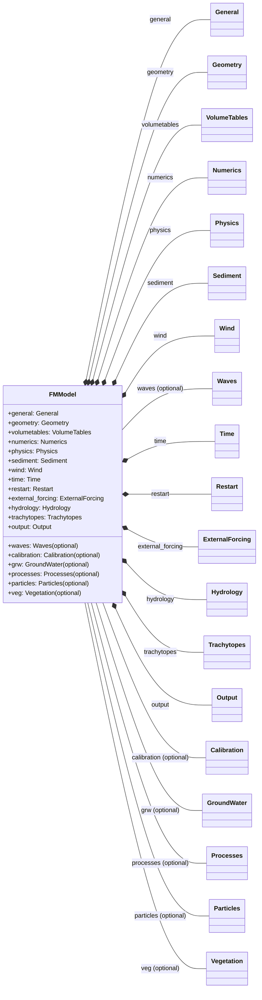

# FMModel attributes: consolidated diagram

This page provides a single, consolidated Mermaid diagram that shows all top‑level attributes of `FMModel` and how they connect to their section types. Optional sections are visually highlighted.

Looking for complete per‑section property lists? See: [FMModel attributes: detailed class diagrams](fm-model-attributes-detailed.md).



Notes

- Required sections use composition links (`*--`).
- Optional sections use a plain association (`--`) and are labeled “(optional)”.
- Field‑level details for each section are documented on their respective reference pages and in the broader `FMModel` diagrams page.

## How to include in navigation

If you maintain the MkDocs navigation manually, add this page under “D-Flow FM → MDU” in `mkdocs.yml`:

```yaml
- reference/dflowfm/mdu/fmmodel-attributes-overview.md
```

Mermaid is already enabled via `pymdownx.superfences` with the `mermaid` fence in this project.
