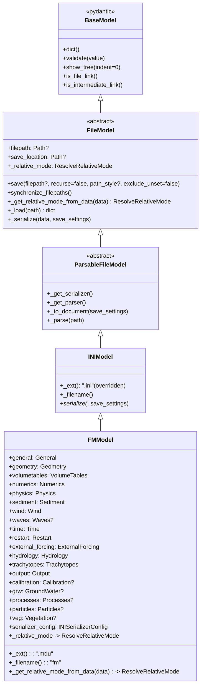
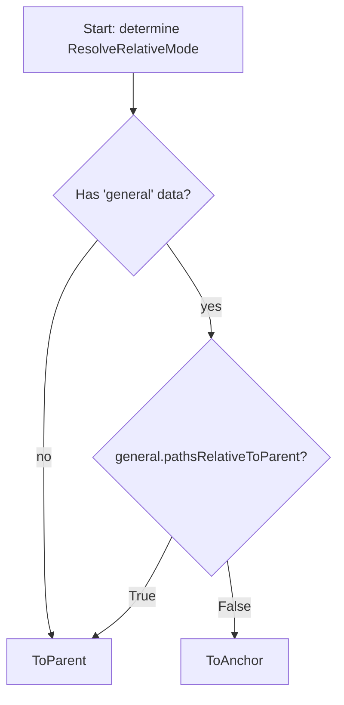
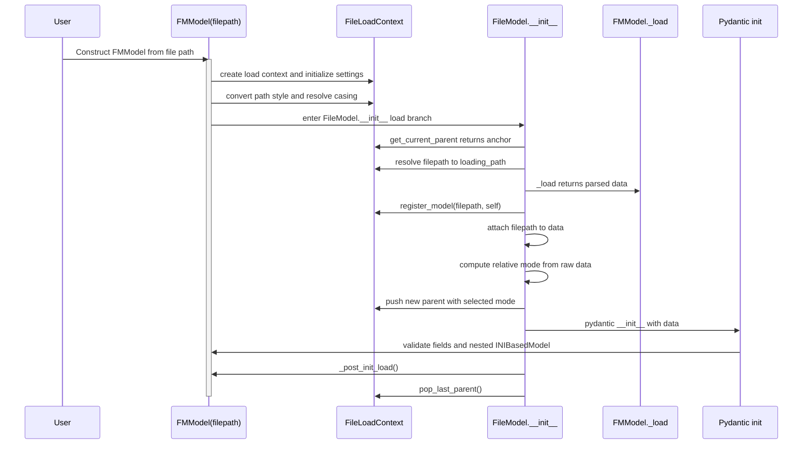
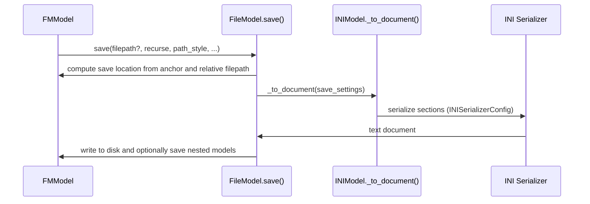
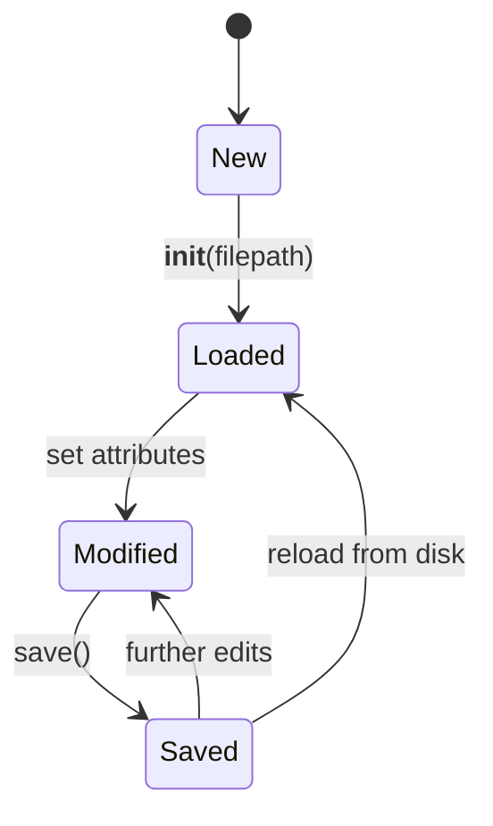

# FMModel: diagrams and internals

This page provides a diagram‑driven documentation of `FMModel` and its ecosystem. It covers:

- Inheritance hierarchy and where core behaviors come from
- Composition of the MDU (`[section]`) blocks as strongly typed submodels
- Validation and serialization pipeline
- Relative path resolution logic controlled by `[General].pathsRelativeToParent`
- Runtime flows for loading and saving
- Practical tips and examples

> Tip: Mermaid diagrams are interactive in this documentation. Zoom is enabled via the panzoom plugin (Ctrl + scroll).

---

## Inheritance overview

`FMModel` inherits from a stack of base classes that provide file I/O, parsing, path management, and (de)serialization.



Relevant sources:

- `hydrolib.core.base.models.BaseModel`, `FileModel`, `ParsableFileModel`
- `hydrolib.core.dflowfm.ini.models.INIModel`
- `hydrolib.core.dflowfm.mdu.models.FMModel`

---

## Composition: MDU sections inside FMModel

Each lowercased attribute on `FMModel` maps to a `[section]` in the MDU file and is backed by its own `INIBasedModel` subclass with field aliases matching the on-disk keys.

```mermaid
classDiagram
    class FMModel
    class General
    class Geometry
    class VolumeTables
    class Numerics
    class Physics
    class Sediment
    class Wind
    class Waves
    class Time
    class Restart
    class ExternalForcing
    class Hydrology
    class Trachytopes
    class Output
    class Calibration
    class GroundWater
    class Processes
    class Particles
    class Vegetation

    FMModel *-- General : 1
    FMModel *-- Geometry : 1
    FMModel *-- VolumeTables : 1
    FMModel *-- Numerics : 1
    FMModel *-- Physics : 1
    FMModel *-- Sediment : 1
    FMModel *-- Wind : 1
    FMModel o-- Waves : 0..1
    FMModel *-- Time : 1
    FMModel *-- Restart : 1
    FMModel *-- ExternalForcing : 1
    FMModel *-- Hydrology : 1
    FMModel *-- Trachytopes : 1
    FMModel *-- Output : 1
    FMModel o-- Calibration : 0..1
    FMModel o-- GroundWater : 0..1
    FMModel o-- Processes : 0..1
    FMModel o-- Particles : 0..1
    FMModel o-- Vegetation : 0..1
```



Notes

- Optional sections are `None` by default and omitted during serialization unless populated.
- Every section class extends `INIBasedModel`, enabling comment support, key aliasing, validators, and deterministic serialization.

---

## Relative path resolution logic

Relative path resolution in `FileModel` is contextual. `FMModel` overrides it to honor `[General].pathsRelativeToParent`:

- If `pathsRelativeToParent = 1` (true): resolve relative paths to the parent directory of the referencing file (ToParent).
- If `pathsRelativeToParent = 0` (false): resolve relative paths to the MDU anchor (ToAnchor, i.e., the top-level model save location).

This is applied both while loading (before Pydantic initialization completes) and for `save_location`/synchronization.



Implementation highlights

- Property override: `FMModel._relative_mode` switches at runtime based on `self.general.pathsrelativetoparent`.
- Early decision on load: `FMModel._get_relative_mode_from_data(data)` inspects raw parsed data (strings) before the model is constructed, so the file load context can push the correct parent.

---

## Load pipeline (sequence)



Key effects

- Nested file references (e.g., inside `[ExternalForcing]`) are resolved relative to the mode decided above.
- The same mechanism supports caching and prevents reparsing of unchanged files.

---

## Save pipeline (sequence)



Serialization details used for section values (`INIBasedModel._convert_value`):

- `bool` is serialized as `0`/`1`.
- `list` uses a configurable delimiter (default space or overridden per field).
- `Enum` uses `.value`.
- `float` uses `INISerializerConfig.float_format`.
- `FileModel` fields serialize to path strings honoring the target `path_style` (Windows/Unix).
- `None` serializes as an empty value.

---

## Validation pipeline for sections

Every `[section]` model inherits from `INIBasedModel`, which adds:

- Unknown key handling via `UnknownKeywordErrorManager`.
- Optional comments block (`Comments`) per section with aliases matching keys.
- Field aliasing for on-disk names (e.g., `refdate` ↔ `refDate`).
- Per-field validators for special formats, e.g.:

```text
# hydrolib.core.dflowfm.mdu.models.Time
@validator("startdatetime", "stopdatetime")
def _validate_datetime(cls, value, field):
    return validate_datetime_string(value, field)
```

- Scientific notation normalization: FORTRAN-style `1d-3` → `1e-3` is handled for incoming strings and lists.
- Duplicate key control and list parsing per model.

These guarantees mean that once `FMModel` is constructed, all subsections are validated Pydantic models ready for inspection and modification.

---

## Quick reference: FMModel fields

- Always present
  - `general: General`
  - `geometry: Geometry`
  - `volumetables: VolumeTables`
  - `numerics: Numerics`
  - `physics: Physics`
  - `sediment: Sediment`
  - `wind: Wind`
  - `time: Time`
  - `restart: Restart`
  - `external_forcing: ExternalForcing`
  - `hydrology: Hydrology`
  - `trachytopes: Trachytopes`
  - `output: Output`
- Optional
  - `waves: Waves | None`
  - `calibration: Calibration | None`
  - `grw: GroundWater | None`
  - `processes: Processes | None`
  - `particles: Particles | None`
  - `veg: Vegetation | None`
- File identity
  - `FMModel._ext() = ".mdu"`
  - `FMModel._filename() = "fm"`
  - `serializer_config.skip_empty_properties = False` (so empty/None properties are not skipped at the top-level)

---

## Lifecycle/state overview



---

## Practical examples

Load, inspect, change relative mode, and save:

```python
from pathlib import Path
from hydrolib.core.dflowfm.mdu.models import FMModel

mdu = FMModel(filepath=Path("/path/to/FlowFM.mdu"))

# Show the model tree
print(mdu.show_tree())

# Switch relative mode by toggling [General].pathsRelativeToParent
mdu.general.pathsrelativetoparent = False  # use anchor-relative (ToAnchor)

# Change a setting and save
mdu.numerics.dtmax = 20.0
mdu.save()  # saves to original location unless a new filepath is provided
```

---

## How to include this page in the navigation

If you maintain the navigation manually, add the following entry under “D-Flow FM → MDU” in `mkdocs.yml`:

```yaml
nav:
  - API Reference:
      - D-Flow FM:
          - MDU:
              - reference/dflowfm/mdu/mdu.md
              - reference/dflowfm/mdu/fmmodel-diagrams.md
```

This page uses Mermaid fenced code blocks (`mermaid`), which is already enabled in the project’s MkDocs configuration.

---

## Pointers to source code

- `hydrolib.core.dflowfm.mdu.models.FMModel`
- `hydrolib.core.dflowfm.ini.models.INIModel`, `INIBasedModel`
- `hydrolib.core.base.models.FileModel`, `ParsableFileModel`, `BaseModel`
- `hydrolib.core.base.file_manager.ResolveRelativeMode`
