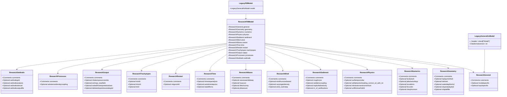
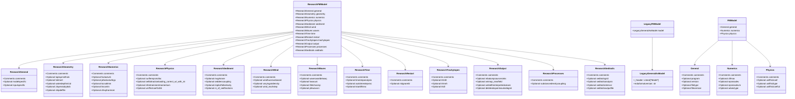

# Research FM Model

research fm model

```mermaid
classDiagram
    class ResearchGeneral {
        +Comments comments
        +Optional modelspecific
        +Optional inputspecific
    }

    class ResearchGeometry {
        +Comments comments
        +Optional toplayminthick
        +Optional helmert
        +Optional waterdepthini1d
        +Optional zlayeratubybob
        +Optional shipdeffile
    }

    class ResearchNumerics {
        +Comments comments
        +Optional faclaxturb
        +Optional jafaclaxturbtyp
        +Optional locsaltmin
        +Optional lincontin
        +Optional cfexphormom
    }

    class ResearchPhysics {
        +Comments comments
        +Optional surftempsmofac
        +Optional selfattractionloading_correct_wl_with_ini
        +Optional nfentrainmentmomentum
        +Optional uniffrictcoef1d2d
    }

    class ResearchSediment {
        +Comments comments
        +Optional mxgrkrone
        +Optional seddenscoupling
        +Optional implicitfallvelocity
        +Optional nr_of_sedfractions
    }

    class ResearchWind {
        +Comments comments
        +Optional windhuorzwsbased
        +Optional varyingairdensity
        +Optional wind_eachstep
    }

    class ResearchWaves {
        +Comments comments
        +Optional waveswartdelwaq
        +Optional hwavuni
        +Optional tifetchcomp
        +Optional phiwavuni
    }

    class ResearchTime {
        +Comments comments
        +Optional timestepanalysis
        +Optional autotimestepvisc
        +Optional tstarttlfsmo
    }

    class ResearchRestart {
        +Comments comments
        +Optional rstignorebl
    }

    class ResearchTrachytopes {
        +Comments comments
        +Optional trtmth
        +Optional trtmnh
        +Optional trtcll
    }

    class ResearchOutput {
        +Comments comments
        +Optional mbalumpsourcesinks
        +Optional wrimap_nearfield
        +Optional writedfminterpretedvalues
        +Optional deleteobspointsoutsidegrid
    }

    class ResearchProcesses {
        +Comments comments
        +Optional substancedensitycoupling
    }

    class ResearchSedtrails {
        +Comments comments
        +Optional sedtrailsgrid
        +Optional sedtrailsanalysis
        +Optional sedtrailsinterval
        +Optional sedtrailsoutputfile
    }

    class ResearchFMModel {
        +ResearchGeneral general
        +ResearchGeometry geometry
        +ResearchNumerics numerics
        +ResearchPhysics physics
        +ResearchSediment sediment
        +ResearchWind wind
        +ResearchWaves waves
        +ResearchTime time
        +ResearchRestart restart
        +ResearchTrachytopes trachytopes
        +ResearchOutput output
        +ResearchProcesses processes
        +ResearchSedtrails sedtrails
    }

    class LegacyGeneralAsModel {
        +_header: Literal["Model"]
        +mduformatversion: str
    }

    class LegacyFMModel {
        +LegacyGeneralAsModel model
    }

    ResearchFMModel --> ResearchGeneral
    ResearchFMModel --> ResearchGeometry
    ResearchFMModel --> ResearchNumerics
    ResearchFMModel --> ResearchPhysics
    ResearchFMModel --> ResearchSediment
    ResearchFMModel --> ResearchWind
    ResearchFMModel --> ResearchWaves
    ResearchFMModel --> ResearchTime
    ResearchFMModel --> ResearchRestart
    ResearchFMModel --> ResearchTrachytopes
    ResearchFMModel --> ResearchOutput
    ResearchFMModel --> ResearchProcesses
    ResearchFMModel --> ResearchSedtrails
    LegacyFMModel --> ResearchFMModel
    LegacyGeneralAsModel --> ResearchGeneral
```

## Model

::: hydrolib.core.dflowfm.research.models

```mermaid
classDiagram
    class ResearchGeneral {
        +Comments comments
        +Optional modelspecific
        +Optional inputspecific
    }
  
    class ResearchGeometry {
        +Comments comments
        +Optional toplayminthick
        +Optional helmert
        +Optional waterdepthini1d
        +Optional zlayeratubybob
        +Optional shipdeffile
    }
  
    class ResearchNumerics {
        +Comments comments
        +Optional faclaxturb
        +Optional jafaclaxturbtyp
        +Optional locsaltmin
        +Optional lincontin
        +Optional cfexphormom
    }
  
    class ResearchPhysics {
        +Comments comments
        +Optional surftempsmofac
        +Optional selfattractionloading_correct_wl_with_ini
        +Optional nfentrainmentmomentum
        +Optional uniffrictcoef1d2d
    }
  
    class ResearchSediment {
        +Comments comments
        +Optional mxgrkrone
        +Optional seddenscoupling
        +Optional implicitfallvelocity
        +Optional nr_of_sedfractions
    }
  
    class ResearchWind {
        +Comments comments
        +Optional windhuorzwsbased
        +Optional varyingairdensity
        +Optional wind_eachstep
    }
  
    class ResearchWaves {
        +Comments comments
        +Optional waveswartdelwaq
        +Optional hwavuni
        +Optional tifetchcomp
        +Optional phiwavuni
    }
  
    class ResearchTime {
        +Comments comments
        +Optional timestepanalysis
        +Optional autotimestepvisc
        +Optional tstarttlfsmo
    }
  
    class ResearchRestart {
        +Comments comments
        +Optional rstignorebl
    }
  
    class ResearchTrachytopes {
        +Comments comments
        +Optional trtmth
        +Optional trtmnh
        +Optional trtcll
    }
  
    class ResearchOutput {
        +Comments comments
        +Optional mbalumpsourcesinks
        +Optional wrimap_nearfield
        +Optional writedfminterpretedvalues
        +Optional deleteobspointsoutsidegrid
    }
  
    class ResearchProcesses {
        +Comments comments
        +Optional substancedensitycoupling
    }
  
    class ResearchSedtrails {
        +Comments comments
        +Optional sedtrailsgrid
        +Optional sedtrailsanalysis
        +Optional sedtrailsinterval
        +Optional sedtrailsoutputfile
    }
  
    class ResearchFMModel {
        +ResearchGeneral general
        +ResearchGeometry geometry
        +ResearchNumerics numerics
        +ResearchPhysics physics
        +ResearchSediment sediment
        +ResearchWind wind
        +ResearchWaves waves
        +ResearchTime time
        +ResearchRestart restart
        +ResearchTrachytopes trachytopes
        +ResearchOutput output
        +ResearchProcesses processes
        +ResearchSedtrails sedtrails
    }
  
    class LegacyGeneralAsModel {
        +_header: Literal["Model"]
        +mduformatversion: str
    }
  
    class LegacyFMModel {
        +LegacyGeneralAsModel model
    }
  
    class General {
        +Comments comments
        +Optional program
        +Optional version
        +Optional filetype
        +Optional fileversion
    }
  
    class Numerics {
        +Comments comments
        +Optional cflmax
        +Optional epsmaxlev
        +Optional epsmaxlevm
        +Optional advectype
    }
  
    class Physics {
        +Comments comments
        +Optional uniffrictcoef
        +Optional uniffricttype
        +Optional uniffrictcoef1d
    }
  
    class FMModel {
        +General general
        +Numerics numerics
        +Physics physics
    }
  
    ResearchFMModel --> ResearchGeneral
    ResearchFMModel --> ResearchGeometry
    ResearchFMModel --> ResearchNumerics
    ResearchFMModel --> ResearchPhysics
    ResearchFMModel --> ResearchSediment
    ResearchFMModel --> ResearchWind
    ResearchFMModel --> ResearchWaves
    ResearchFMModel --> ResearchTime
    ResearchFMModel --> ResearchRestart
    ResearchFMModel --> ResearchTrachytopes
    ResearchFMModel --> ResearchOutput
    ResearchFMModel --> ResearchProcesses
    ResearchFMModel --> ResearchSedtrails
  
    LegacyFMModel --> LegacyGeneralAsModel
  
    FMModel --> General
    FMModel --> Numerics
    FMModel --> Physics

```
