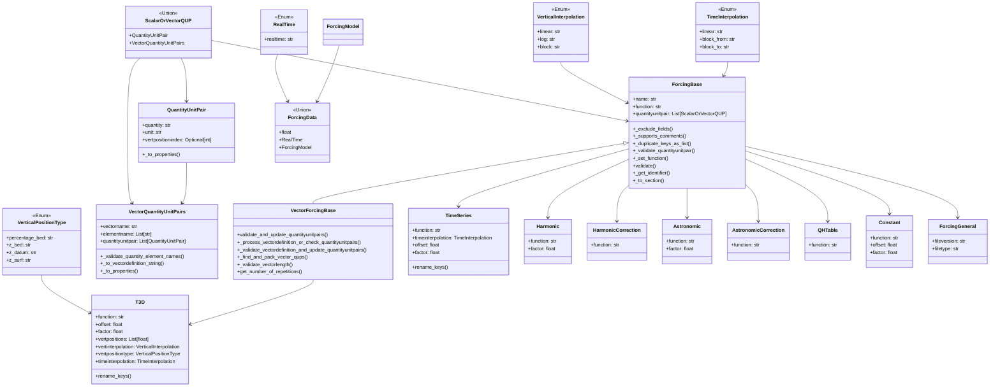

# Forcings .bc file
The forcings .bc files contain forcing data for point locations,
for example time series input for a boundary condition. Various
quantities and function types are supported.

The forcings file is represented by the classes below.

## Model
::: hydrolib.core.dflowfm.bc.models
