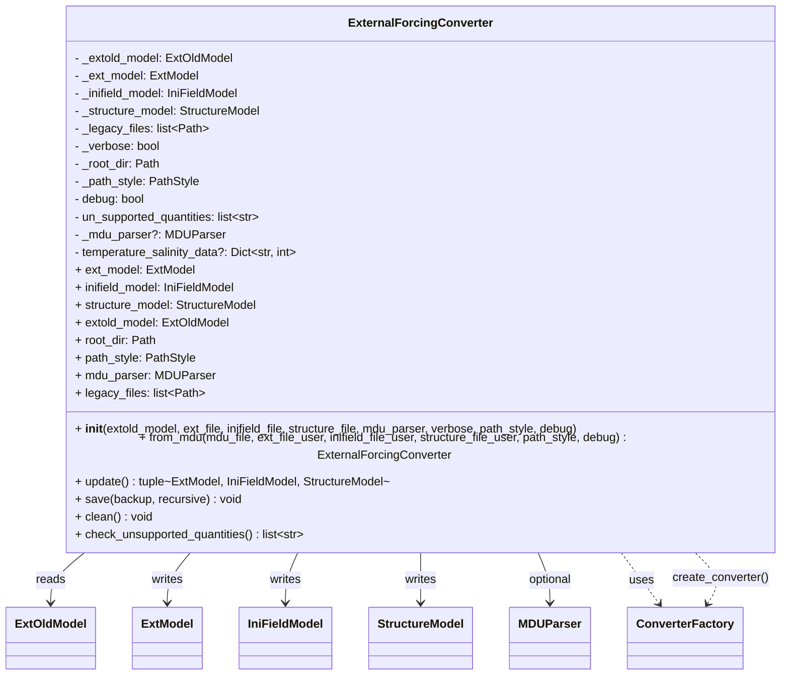
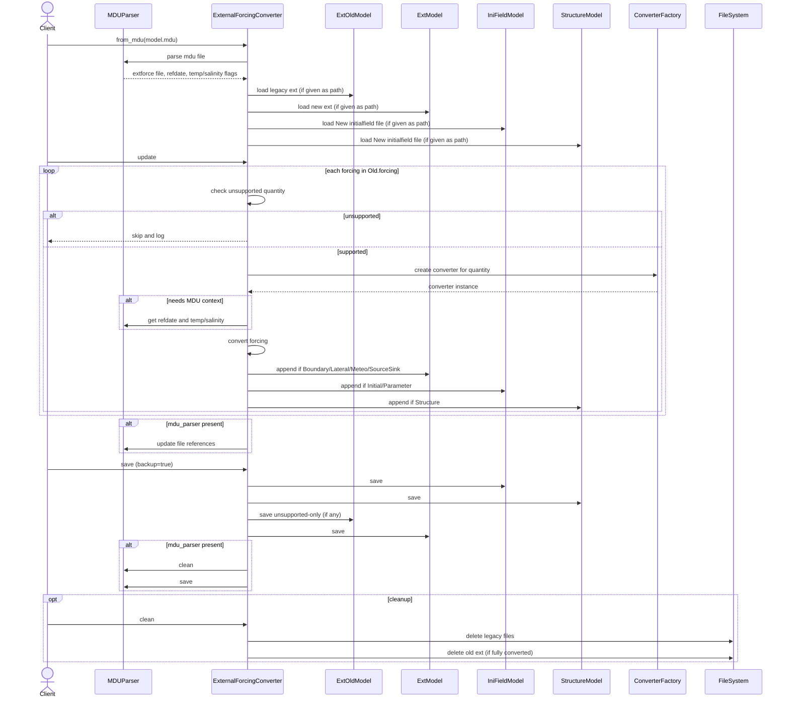
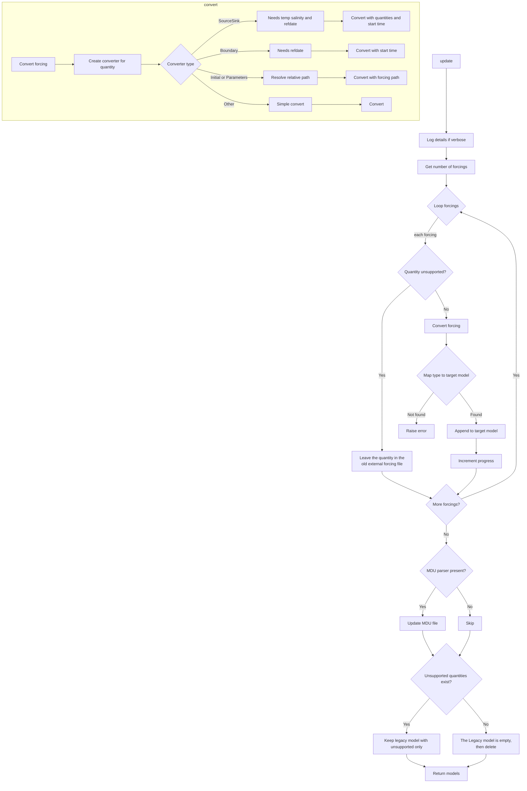
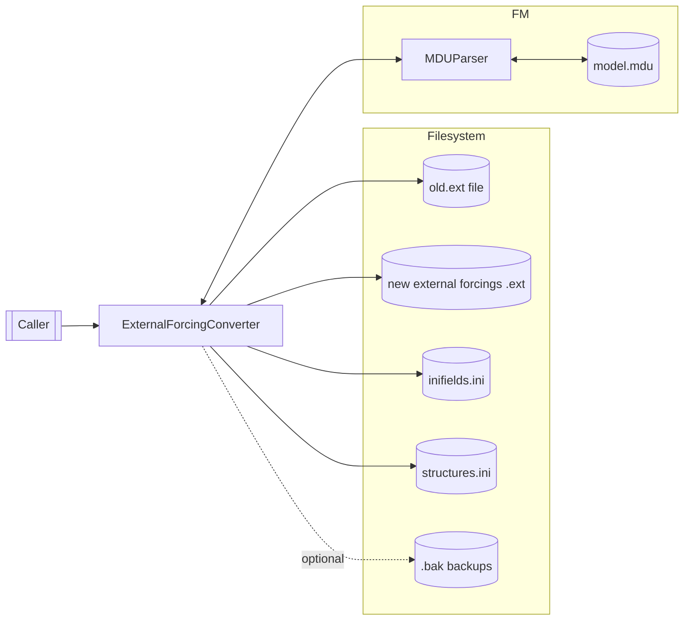

# External Forcing Converter
### 2.1. High-Level Overview

`ExternalForcingConverter` converts legacy D-Flow FM external forcings files (old `.ext` format, represented by `ExtOldModel`) into the newer model structure consisting of:

- A new external forcings file (`ExtModel`) with boundary, lateral, meteo, and source/sink blocks.
- An initial fields file (`IniFieldModel`) with `InitialField` and `ParameterField` blocks.
- A structures file (`StructureModel`) with `Structure` blocks.

It orchestrates per-forcing conversion using a pluggable converter factory (`ConverterFactory`) that selects a concrete converter based on the forcing quantity. The class can optionally update an MDU file (`MDUParser`) to point to the newly generated files and can back up/clean legacy artifacts.

Typical place in a larger system: infrastructure/tooling layer. It acts as a migration utility or pipeline step used to modernize project inputs.

### 2.2. Key Responsibilities and Collaborations

Primary responsibilities:

- Load a legacy external forcings file into `ExtOldModel` (or accept a provided instance).
- For each forcing block:
  - Detect and skip unsupported quantities (optionally strict or permissive via `debug`).
  - Choose and invoke the appropriate converter via `ConverterFactory`.
  - Append the converted block to the correct target model (`ExtModel`, `IniFieldModel`, or `StructureModel`).
- Optionally update the MDU file to reference new outputs and remove the old external forcing file if fully converted.
- Persist new models to disk with optional backups; optionally remove legacy files produced during conversion.

Key collaborators and how they’re used:

- `hydrolib.core.dflowfm.extold.models.ExtOldModel` (input): Parsed representation of old `.ext`; the source of forcings.
- `hydrolib.core.dflowfm.ext.models.ExtModel` (output): Destination model for boundary, lateral, meteo, sources/sinks.
- `hydrolib.core.dflowfm.inifield.models.IniFieldModel` (output): Destination model for initial/parameter fields.
- `hydrolib.core.dflowfm.structure.models.StructureModel` (output): Destination model for structures.
- `hydrolib.tools.extforce_convert.converters.ConverterFactory` (strategy selection): Creates the correct converter class for a given quantity.
  - `BoundaryConditionConverter`, `SourceSinkConverter`, `InitialConditionConverter`, `ParametersConverter` are concrete converters used depending on the quantity.
- `hydrolib.tools.extforce_convert.mdu_parser.MDUParser` (optional): Reads MDU metadata (e.g., `refdate`, temperature/salinity flags) and updates references to new files.
- `hydrolib.tools.extforce_convert.utils.CONVERTER_DATA` (capabilities): Reports unsupported quantities.
- `hydrolib.tools.extforce_convert.utils.construct_filemodel_new_or_existing` (model builder): Ensures destination models exist (new or from existing files) with minimal recursion.
- `hydrolib.tools.extforce_convert.utils.backup_file` (safety): Creates backups before overwriting.
- `tqdm` (UX): Progress bar during conversion.
- File system (I/O): Reading old file, writing new files, backups, optional deletions.

### 2.3. Public API Documentation

Class: `ExternalForcingConverter`

- Purpose: Convert legacy external forcing data to the new model structure and optionally update the MDU file.

Constructor

- `__init__(
    extold_model: Union[PathOrStr, ExtOldModel],
    ext_file: Optional[PathOrStr] = None,
    inifield_file: Optional[PathOrStr] = None,
    structure_file: Optional[PathOrStr] = None,
    mdu_parser: MDUParser = None,
    verbose: bool = False,
    path_style: PathStyle = None,
    debug: Optional[bool] = False,
  )`
  - Parameters:
    - `extold_model`: Path to legacy `.ext` or an `ExtOldModel` instance. If a path or str, the file is loaded via `_read_old_file()`.
    - `ext_file`: Destination path for new external forcings (`ExtModel`). Defaults to `new-external-forcing.ext` in the same directory as the legacy file.
    - `inifield_file`: Destination path for `IniFieldModel`. Defaults to `new-initial-conditions.ini`.
    - `structure_file`: Destination path for `StructureModel`. Defaults to `new-structure.ini`.
    - `mdu_parser`: Optional `MDUParser` to provide FM metadata (e.g., `refdate`, temperature/salinity) and to update the MDU file.
    - `verbose`: If `True`, prints conversion details to stdout.
    - `path_style`: Controls conversion/interpretation of absolute paths (Windows/Unix style) when reading/writing models.
    - `debug`: If `True`, unsupported quantities are skipped (not converted) without raising; otherwise an error is raised.
  - Side effects:
    - May read the legacy `.ext` file.
    - Creates model objects for new outputs (not yet written).
    - Computes `un_supported_quantities` early via `check_unsupported_quantities()`.
  - Exceptions:
    - `FileNotFoundError` if the path to the legacy file doesn’t exist.
    - `TypeError` if `extold_model` is neither a path nor an `ExtOldModel`.

Classmethod

- `from_mdu(
    mdu_file: PathOrStr,
    ext_file_user: Optional[PathOrStr] = None,
    inifield_file_user: Optional[PathOrStr] = None,
    structure_file_user: Optional[PathOrStr] = None,
    path_style: Optional[PathStyle] = None,
    debug: bool = False,
  ) -> ExternalForcingConverter`
  - Purpose: Create a converter using paths resolved from an MDU file.
  - Parameters: as above, with explicit user overrides for destination files.
  - Returns: A fully initialized `ExternalForcingConverter`.
  - Side effects: Parses the MDU file; determines legacy `.ext` path and output file paths.
  - Exceptions (per docstring and expected behavior):
    - `FileNotFoundError` if MDU is missing.
    - `ValueError` if the legacy ext file is not found in the MDU.
    - `DeprecationWarning` if unknown keywords in the MDU (raised by `MDUParser`).

Properties

- `legacy_files: list[Path]`
  - Get: Returns a list of legacy files produced during conversion (e.g., old `.tim` files) to potentially delete later.
  - Set: Appends given list of Paths to the internal list. Type-checked; raises `TypeError` if not a list.

- `verbose: bool`
  - Get/Set: Controls additional logging to stdout.

- `mdu_parser: Optional[MDUParser]`
  - Get: Returns `MDUParser` if set; otherwise `None`.

- `root_dir: Path`
  - Get: Directory inferred from the provided legacy `.ext` file or the MDU’s location.

- `path_style: Optional[PathStyle]`
  - Get: Path style used when saving models (absolute path handling).

- `extold_model: ExtOldModel`
  - Get: The loaded legacy model.

- `ext_model: ExtModel`
  - Get: Destination external forcings model. Raises `ValueError` if unexpectedly unset.
  - Set: `ext_model(path: PathOrStr)`: Replaces the destination model using `construct_filemodel_new_or_existing`.

- `inifield_model: IniFieldModel`
  - Get/Set analogous to `ext_model`.

- `structure_model: StructureModel`
  - Get/Set analogous to `ext_model`.

- `un_supported_quantities: list[str]`
  - Set during initialization by `check_unsupported_quantities()`. Lowercased quantity names that are unsupported according to `CONVERTER_DATA`.

- Conditional attribute: `temperature_salinity_data: Dict[str, int]`
  - Present only if `mdu_parser` is provided; used for `SourceSink` and boundary conversions (needs `refdate`).

Public methods

- `check_unsupported_quantities(self) -> list[str]`
  - Returns: List of unsupported quantities found in `extold_model` (lowercased).
  - Side effects: None.
  - Exceptions: If `debug` is `False`, errors on unsupported quantities (raised by `CONVERTER_DATA.check_unsupported_quantities`).

- `update(self) -> tuple[ExtModel, IniFieldModel, StructureModel] | None`
  - Purpose: Convert all eligible forcings from the legacy model and append them to the correct destination models.
  - Behavior:
    - Logs details if `verbose`.
    - Iterates forcings, shows a progress bar (`tqdm`).
    - For unsupported quantities: prints a message (with `debug` state) and skips.
    - For supported quantities: calls `_convert_forcing`, maps the resulting block type to the correct destination model (`_type_field_map`) and appends it.
    - If `mdu_parser` exists, updates the MDU file.
    - If any unsupported quantities exist, prunes `extold_model.forcing` to contain only those remaining unsupported forcings.
  - Returns: `(ext_model, inifield_model, structure_model)` for inspection by callers.
  - Side effects: Updates in-memory models; prints progress/logs; modifies `extold_model.forcing` contents if unsupported quantities exist.
  - Exceptions:
    - `NotImplementedError` if a converted block’s type is unknown to `_type_field_map`.
    - `ValueError` from `_convert_forcing` if required MDU data is missing for certain converters.

- `save(self, backup: bool = True, recursive: bool = True) -> None`
  - Purpose: Persist the new/updated models to disk. Update MDU parser file if present.
  - Behavior:
    - Saves `IniFieldModel` if it has any `initial`/`parameter` entries (with `exclude_unset=False` per kernel requirements).
    - Saves `StructureModel` if it has any `structure` entries.
    - If unsupported quantities exist, backs up and saves the old `ExtOldModel` (containing only unsupported entries after `update`).
    - Saves `ExtModel` if any of its sections contain items (makes backup first if overwriting and `backup=True`).
    - If `mdu_parser` exists, calls `mdu_parser.clean()` and `mdu_parser.save(backup=backup)`.
  - Side effects: File I/O, backups, writes MDU.

- `clean(self) -> None`
  - Purpose: Remove legacy artifacts (e.g., time files) and delete the old `.ext` file if fully converted.
  - Behavior:
    - Deletes any files listed in `legacy_files` and prints their paths.
    - If there are no remaining unsupported quantities, deletes the legacy `.ext` file itself.
  - Side effects: File deletions.

Static/Protected helpers (summarized for completeness; not typically called by clients)

- `_read_old_file(ext_old_file: PathOrStr, path_style: Optional[PathStyle]) -> ExtOldModel`
- `_type_field_map(self) -> dict[type, tuple[Any, str]]` (maps block types to destination models/attributes).
- `_convert_forcing(self, forcing) -> Union[Boundary, Lateral, Meteo, SourceSink, InitialField, ParameterField, Structure]`
  - Note: The annotation in code lists only `Boundary|Lateral|Meteo|SourceSink`, but actual behavior includes `InitialField`, `ParameterField`, and `Structure` via the specific converters.
  - Exceptions: `ValueError` if MDU info missing for `SourceSink` or boundary conversions.
- `_update_mdu_file(self) -> None`
- `_save_inifield_model(self, backup: bool, recursive: bool) -> None`
- `_save_structure_model(self, backup: bool, recursive: bool) -> None`
- `_log_conversion_details(self) -> None`

Example usage

- From legacy model object

```python
from pathlib import Path
from hydrolib.core.dflowfm.extold.models import ExtOldModel
from hydrolib.tools.extforce_convert.main_converter import ExternalForcingConverter

# Prepare a minimal ExtOldModel in memory
root_dir = Path("path/to/your/root/dir")
forcing_data = {
    'QUANTITY': 'windspeedfactor',
    'FILENAME': rf'{root_dir}/my-poly-file.pol',
    'FILETYPE': '11',
    'METHOD': '4',
    'OPERAND': 'O',
}
forcing_model_data = {
    'comment': [' Example (old-style) external forcings file'],
    'forcing': [forcing_data]
}
old_model = ExtOldModel(**forcing_model_data)  
converter = ExternalForcingConverter(extold_model=old_model, verbose=True)  
ext_model, ini_model, struct_model = converter.update()  
converter.save(backup=True)  
```

- From legacy file path

```python
from hydrolib.tools.extforce_convert.main_converter import ExternalForcingConverter

converter = ExternalForcingConverter("old-external-forcing.ext", verbose=True)  
converter.update()  
converter.save()  
```

- From MDU file (recommended for quantities needing FM metadata)

```python
from hydrolib.tools.extforce_convert.main_converter import ExternalForcingConverter

converter = ExternalForcingConverter.from_mdu("model.mdu", debug=False)  
converter.update()  
converter.save(backup=True)  
# Optional: remove legacy artifacts if nothing left unsupported
converter.clean()  
```

### 2.4. Lifecycle & Control Flow Explanation

Typical creation and use:

1. Instantiate the converter:
   - Provide either a path to the legacy `.ext` or an `ExtOldModel` instance.
   - Optionally provide `mdu_parser` (or use `from_mdu`), which is required for certain conversions:
     - `SourceSink` needs temperature/salinity flags and `refdate`.
     - Boundary condition conversion needs `refdate` (start time).
2. Call `update()`:
   - For each forcing block in `extold_model.forcing`:
     - If the quantity is unsupported, it is skipped and remains in `extold_model` (post-update the legacy model contains only these unsupported entries).
     - Otherwise, a concrete converter is created (`ConverterFactory.create_converter`) and `convert()` is invoked with the required context.
     - The converted block is appended to the appropriate destination model, chosen by type.
   - If `mdu_parser` exists, `_update_mdu_file()` modifies MDU references to point to the new files and (optionally) remove the old ext file reference if everything was converted.
3. Call `save()` to write outputs to disk, with backups as needed.
4. Optionally call `clean()` to delete any temporary legacy files and, when fully converted, remove the old `.ext` file.

Important invariants/constraints:

- If converting `SourceSink` or boundary conditions, `mdu_parser` (or equivalent `temperature_salinity_data` and `refdate`) must be available; otherwise a `ValueError` is raised.
- `un_supported_quantities` are determined at initialization:
  - `debug=False` (strict): raises on unsupported quantities during detection.
  - `debug=True` (permissive): allows conversion to proceed, skipping unsupported ones.
- Destination models are created (or opened if existing) in the legacy file’s directory unless explicitly overridden.
- When saving `IniFieldModel`, `exclude_unset=False` is used to satisfy kernel requirements.

---

### 3. Mermaid Diagrams (Derived from Code)

#### 3.1. Class Structure Diagram



#### 3.2. Main Usage / Sequence Diagram



#### 3.3. Control Flow / Logic Diagram



#### 3.4. State Diagram

This class maintains state (models, flags) but does not have a small, finite set of modes with strict transitions. Therefore, a formal state diagram is omitted.

#### 3.5. Component / Integration Diagram



---

### 4. Design & Architecture Notes

- Patterns:
  - Factory/Strategy: `ConverterFactory` selects a specialized converter per quantity; each converter encapsulates conversion logic.
  - Facade/Coordinator: `ExternalForcingConverter` orchestrates multiple subsystems (models, MDU, converters, filesystem) to provide a simple `update/save/clean` workflow.
  - Factory Method: `from_mdu` is a named constructor that assembles a properly configured instance from an MDU file.
- Cohesion & scope: High cohesion around conversion concerns; the class mediates between input model, conversion strategies, and output models.
- Extension points:
  - Add new quantity support by adding a converter and registering it in `ConverterFactory` and `CONVERTER_DATA`.
  - `_type_field_map` defines how converted block types are routed; extending with new block types would require updating this mapping.
- Contracts/assumptions:
  - Some conversions require FM metadata (e.g., `refdate`, temperature/salinity flags) from `MDUParser`.
  - `path_style` must align with the environment if absolute paths appear in models.
  - When `debug=False`, unsupported quantities should be resolved before proceeding; otherwise initialization will error.
  - The annotation on `_convert_forcing` under-represents its actual return possibilities; callers should rely on `_type_field_map` (or concrete converter contracts) rather than the annotation.

---

### 5. Usage Examples

1) Convert using a legacy `.ext` path

```python
from hydrolib.tools.extforce_convert.main_converter import ExternalForcingConverter

converter = ExternalForcingConverter(
    extold_model="path/to/old-forcings.ext",
    verbose=True,
    debug=True,  # skip unsupported quantities without raising
)
converter.update()
converter.save(backup=True)
# If everything converted and you want to remove legacy artifacts
converter.clean()
```

2) Convert using `from_mdu` (recommended for `SourceSink`/boundary quantities)

```python
from hydrolib.tools.extforce_convert.main_converter import ExternalForcingConverter

converter = ExternalForcingConverter.from_mdu(
    mdu_file="path/to/model.mdu",
    ext_file_user="path/to/output/forcings.ext",  # optional override
)
converter.update()     # performs conversion and updates MDU references
converter.save()       # writes new models and MDU; may back up existing files
```

3) Provide custom output file locations

```python
from hydrolib.tools.extforce_convert.main_converter import ExternalForcingConverter

converter = ExternalForcingConverter(
    extold_model=".../old.ext",
    ext_file=".../new/forcings.ext",
    inifield_file=".../new/inifields.ini",
    structure_file=".../new/structures.ini",
)
converter.update()
converter.save()
```

4) Programmatic inspection after update

```python
from hydrolib.tools.extforce_convert.main_converter import ExternalForcingConverter

# Create a converter (example path; adjust as needed)
converter = ExternalForcingConverter("path/to/old-forcings.ext")  

ext_model, ini_model, struct_model = converter.update()  
print(len(ext_model.meteo), len(ext_model.boundary))      
print(len(ini_model.initial), len(ini_model.parameter))   
print(len(struct_model.structure))                        
```

---

### 6. Quality & Safety Requirements

- No undocumented behavior is assumed. Where converter internals are not shown, the documentation limits itself to what the class contracts expose.
- Assumption: Specifics of `MDUParser` exceptions and converter outputs align with their documented/typical behavior.
- Mermaid snippets above are valid and derived from the visible control flow in this module.
- This document is self-contained and suitable for inclusion in a docs site or repository README.